---
aliases:
  - mermaid
tags:
  - "#流程图"
  - "#笔记法"
---


## Mermaid的定义与核心价值
Mermaid是一种基于JavaScript的开源图表绘制工具，它采用**声明式文本语法**生成矢量图表，实现了“文本即图形”（Diagrams-as-code）的核心理念。与传统拖拽式绘图工具不同，Mermaid允许用户通过简单的类Markdown语法描述图表结构，由渲染引擎自动完成布局和可视化输出。这种范式变革使得技术绘图可版本化管理、支持自动化工作流，并显著提升协作效率。

Mermaid的核心优势体现在三个维度：
- **效率革命**：将绘图时间从小时级缩短至分钟级，例如绘制10节点流程图仅需5行文本代码
- **无缝集成**：原生支持GitHub/GitLab Markdown、VS Code、Obsidian等开发环境，实现文档与图表同源管理
- **类型覆盖**：支持流程图、时序图、类图、甘特图、状态图等14种专业图表类型，满足全场景技术绘图需求

## 语法体系深度解析
### 示例
Mermaid流程图由**节点**（Nodes）和**边**（Edges）构成，通过声明式语法描述拓扑关系：
```code
flowchart TD
    A[开始] --> B{条件判断}
    B -->|成立| C[执行操作]
    B -->|不成立| D[结束流程]
```
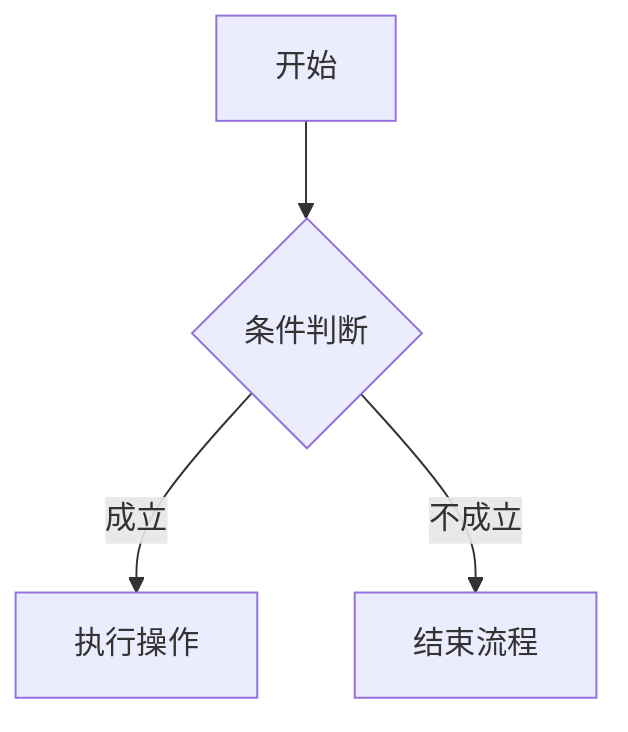

### 流程图 (Flowchart)
**方向：**
- `TD` / `TB`：从上到下 (Top to Bottom)
- `LR`：从左到右 (Left to Right)
- `RL`：从右到左 (Right to Left)
- `BT`：从下到上 (Bottom to Top)

**节点形状：**
- `[矩形]`
- `(圆边矩形)`
- `{菱形}`
- `((圆形))`

**连接线：**
- `-->`：实线箭头
- `---`：实线无箭头
- `-.->`：虚线箭头
- `==>`：粗线箭头
- `-- 文字 -->`：带文字的连接线
- `--o`：圆形端点
- `--x`：叉形端点

### 序列图 (Sequence Diagram)
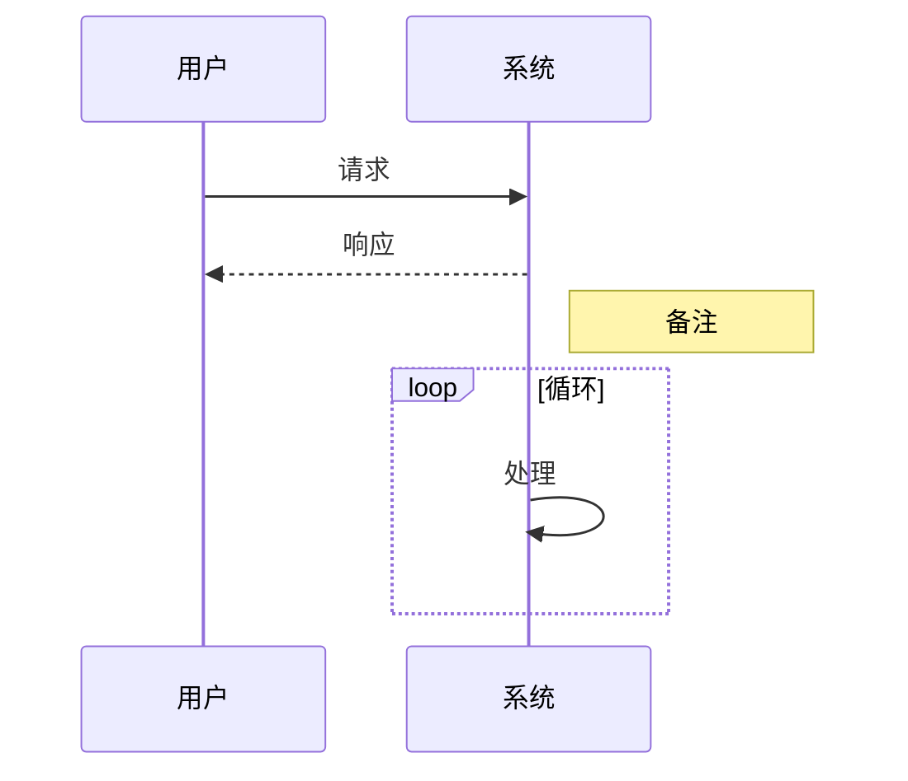

**箭头类型：**
- `->>`：实线箭头
- `-->>`：虚线箭头
- `->x`：带x的箭头

### 类图 (Class Diagram)
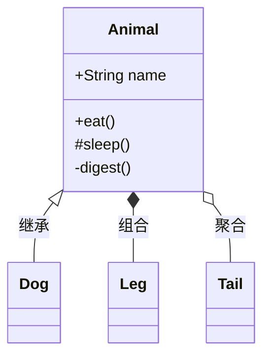

**可见性：**
- `+`：public
- `-`：private
- `#`：protected
- `~`：package/internal

**关系：**
- `<|--`：继承
- `*--`：组合
- `o--`：聚合
- `-->`：关联

### 状态图 (State Diagram)
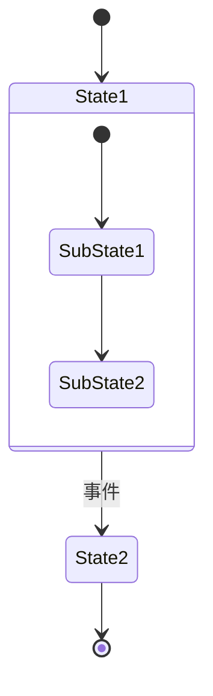

### 甘特图 (Gantry Chart)
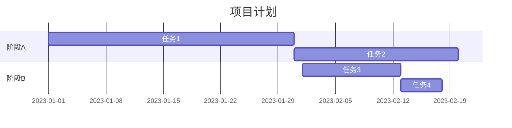

### 饼图 (Pie Chart)
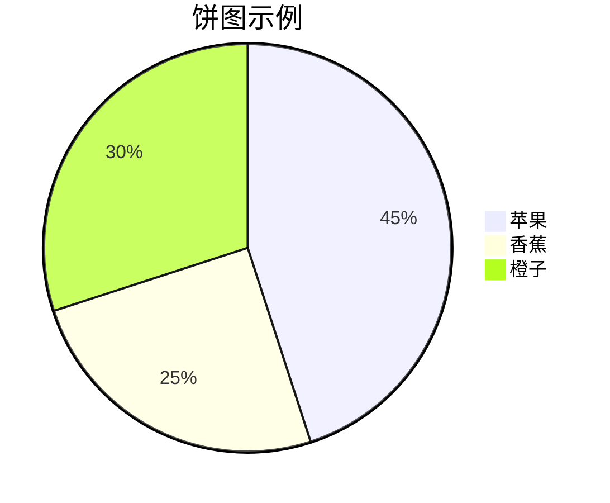

### 样式定义
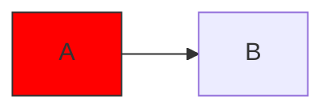

**常用样式属性：**
- `fill`：填充颜色
- `stroke`：边框颜色
- `stroke-width`：边框粗细
- `color`：文字颜色

### 子图嵌套与方向控制
复杂系统需通过子图（subgraph）分层组织：
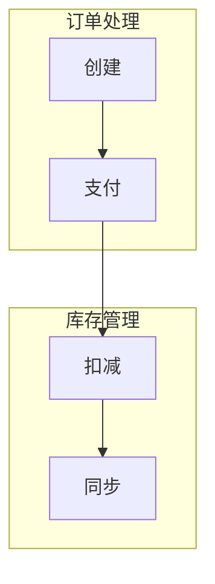
- **方向隔离**：子图内可独立设置`direction`属性
- **折叠支持**：大型图表可通过折叠子图提升可读性

## 数学基础与自动布局原理
### 图论模型抽象
Mermaid将流程图抽象为有向图$G=(V,E)$，其中：
- 顶点集 $V = \{v_1,v_2,\dots,v_n\}$ 对应节点
- 边集 $E \subseteq \{(v_i,v_j) | v_i,v_j \in V\}$ 表示连接关系

布局引擎采用**分层算法**（Layer-Based Layout）：
1. **环破坏**（Cycle Breaking）：通过反转边消除环路
2. **层级分配**（Layer Assignment）：使用CopperRank算法优化层级
3. **顶点排序**（Vertex Ordering）：减少边交叉数
4. **坐标计算**（Coordinate Calculation）：基于约束求解布局

### 样式渲染数学模型
Mermaid支持CSS驱动的样式定制，其颜色模型采用HSLA空间：
$$
\text{Color} = \text{HSLA}(H, S, L, A)
$$
其中：
- $H \in [0, 360]$ 色相
- $S \in [0, 100\%]$ 饱和度
- $L \in [0, 100\%]$ 明度
- $A \in [0, 1]$ 透明度

通过类定义实现样式复用：
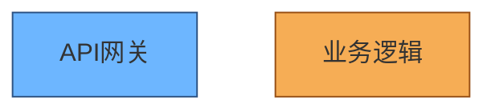

## 典型应用场景与最佳实践
### 系统架构可视化
微服务架构描述示例：
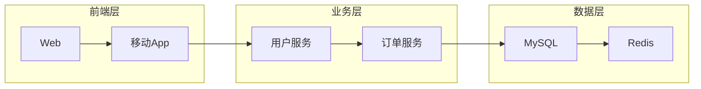
**实践要点**：
- 按架构分层使用子图分组
- 相同层级保持统一方向
- 关键服务使用高对比色标识

### 业务流程建模
电商订单状态机：
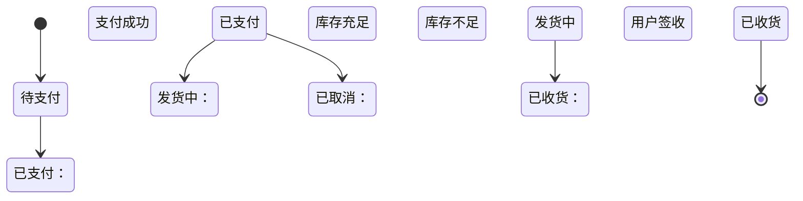
**设计规范**：
- 核心状态不超过7个
- 使用`stateDiagram-v2`语法
- 终态明确标注`[*]`

### 动态交互实现
Mermaid支持通过`click`指令添加交互：
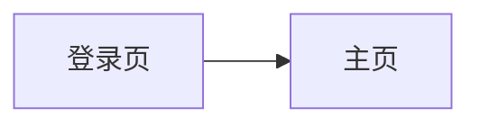
结合JavaScript实现完整交互逻辑：
```js
const callback = () => {
    alert('进入主页');
};
```

## 总结与学习资源
### 核心价值再认知
Mermaid通过**文本驱动可视化**重塑技术绘图工作流：
- **版本化**：图表代码可纳入Git管理
- **自动化**：CI/CD流水线自动生成图表
- **协作化**：实时协同编辑避免格式错乱

### 推荐工具链
- **开发环境**：VS Code + Mermaid插件（实时预览）
- **在线编辑**：https://mermaid.live/
- **团队协作**：boardmix博思白板（支持AI生成）
- **文档集成**：Obsidian/Notion原生支持

### 学习路径
1. **基础语法**：https://mermaid.js.org/
2. **进阶技巧**：《Mermaid流程图深度教程》
3. **实战案例**：参考电商订单系统实现
4. **社区参与**：GitHub https://github.com/mermaid-js项目

> 技术的本质是抽象的艺术，Mermaid将可视化抽象为文本，恰如编程将逻辑抽象为代码。掌握这门语言，便是掌握了用符号构建世界的钥匙。