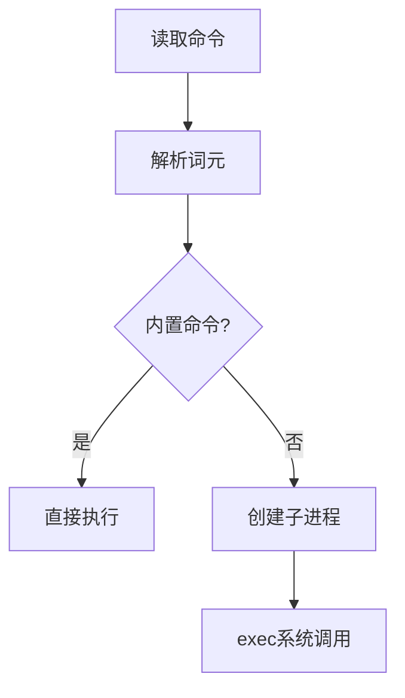

#shell


## 定义与核心价值
**Shell编程**是通过编写脚本（Script）在命令行解释器中执行自动化任务的技术。作为用户与操作系统内核之间的桥梁，Shell不仅提供交互式命令执行环境，更是一种具备流程控制、变量管理等特性的脚本语言。其核心价值体现在：
- **自动化**：通过脚本批量处理重复任务（如日志清理、文件备份）
- **系统管理**：实现用户权限管理、服务监控等运维操作
- **胶水语言**：串联不同程序（如Python工具链与C++编译流程）

## 发展历史
1. **起源（1971）**  
   Ken Thompson为UNIX开发了首个Shell（V6 Shell），支持基本重定向（`>`）和管道（`|`）操作。

2. **标准化演进**  
   - **Bourne Shell（sh，1977）**：引入脚本编程能力，支持`if`/`for`等控制结构
   - **C Shell（csh，1978）**：添加命令历史、别名功能，语法类似C语言
   - **Bash（1989）**：融合sh与csh特性，成为Linux默认Shell

3. **现代扩展**  
   2020年后，Zsh的智能补全、Fish的友好交互设计进一步提升了开发体验。

---

## 工作原理与执行模型
### 解释器架构
Shell脚本执行流程遵循“读取-解析-执行”循环：


### 关键机制
1. **变量作用域**  
   - 环境变量（`export VAR=value`）跨进程共享
   - 局部变量（`local var`）仅在函数内有效

2. **进程管理**  
   通过`&`实现后台运行，`wait`同步子进程：
   ```bash
   gzip large.log &  # 后台压缩
   wait  # 等待所有后台任务完成
   ```

3. **输入输出重定向**  
   使用文件描述符控制数据流：
   ```bash
   command > output.log 2>&1  # 合并标准输出与错误输出
   ```

---

## 典型应用场景
### 1. 系统运维自动化
**案例**：每日凌晨压缩日志并备份至NAS：
```bash
#!/bin/bash
LOG_DIR="/var/log/app"
BACKUP_DIR="/mnt/nas/backup_$(date +%F)"

mkdir -p $BACKUP_DIR
find $LOG_DIR -name "*.log" -mtime +7 | xargs tar czf $BACKUP_DIR/archive.tgz
```


### 2. 持续集成流水线
集成Git钩子实现代码提交时自动测试：
```bash
# .git/hooks/pre-commit
#!/bin/sh
npm test && eslint src/
exit $?  # 测试失败则阻止提交
```

### 3. 数据处理管道
统计Nginx访问日志中的高频IP：
```bash
awk '{print $1}' access.log | sort | uniq -c | sort -nr | head -10
```

---

## 最佳实践与性能优化
### 代码规范
1. **错误处理**  
   启用严格模式避免常见陷阱：
   ```bash
   set -euo pipefail  # 遇错即停/未定义变量报错/捕获管道错误
   ```

2. **可读性**  
   - 使用`[[ ]]`替代`[ ]`增强条件判断
   - 遵循Google Shell Style Guide缩进规则

### 性能调优
| 操作 | 低效写法 | 高效替代 |
|------|---------|---------|
| 数学运算 | `expr $a + $b` | `$((a + b))` |
| 文本处理 | 多行`sed` | 单次`awk`调用 |
| 循环遍历 | `for i in $(ls)` | `while read -r file`

### 调试技巧
1. **运行时追踪**  
   ```bash
   bash -x script.sh  # 显示每条执行命令
   ```
2. **信号捕获**  
   ```bash
   trap 'echo "中断! 清理临时文件..."; rm -rf /tmp/*' SIGINT
   ```

---

## 代码示例库
### 1. 安全密码生成器
```bash
generate_password() {
  local length=${1:-12}
  tr -dc 'A-Za-z0-9!@#$%^&' </dev/urandom | head -c $length
}
```

### 2. 多平台兼容安装脚本
```bash
#!/usr/bin/env bash
case "$(uname)" in
  Linux*)  pkg_mgr="apt-get" ;;
  Darwin*) pkg_mgr="brew" ;;
  *)       echo "Unsupported OS"; exit 1 ;;
esac

$pkg_mgr install -y python3
```

---

## 未来趋势
随着DevOps和云原生的发展，Shell编程正在与新技术融合：
- **Kubernetes生态**：通过`kubectl`脚本管理容器集群
- **Serverless**：AWS Lambda等平台支持Shell作为运行时
- **AI增强**：GitHub Copilot已支持Shell脚本智能补全

> **参考资料**  
> [Shell编程原理详解](https://example.com/shell-basics)  
> [Bash高级技巧手册](https://example.com/bash-pro)
