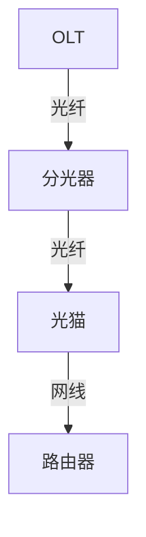

# 光猫是什么？在宽带入户中的作用？

## 定义与基本概念

**光猫**（Optical Network Terminal，ONT），又称**光纤调制解调器**，是将光纤传输的光信号转换为电信号的设备。它是光纤到户（FTTH）网络中的关键终端设备，负责实现用户端与运营商光纤网络之间的信号转换。

光猫的核心功能是通过光电转换模块（O/E）将光纤中的光脉冲信号（波长通常为1310nm/1490nm）转换为以太网电信号（RJ45接口），同时支持反向电光转换（E/O）。其技术标准遵循ITU-T G.984（GPON）或IEEE 802.3ah（EPON）协议。

## 发展历程与技术演进

### 技术发展时间线
- **2000年代初**：第一代光猫仅支持基础光电转换，速率≤100Mbps
- **2010年**：GPON标准（ITU-T G.984.4）普及，支持2.5G下行/1.25G上行
- **2015年**：XG-PON（10G-PON）商用，速率提升至10Gbps
- **2020年**：Wi-Fi 6光猫一体机成为主流
- **2023年**：50G-PON标准（ITU-T G.9804.3）发布

### 架构演进对比
| 世代 | 典型型号 | 关键技术 | 最大速率 |
|------|----------|----------|----------|
| 1st  | HG8240   | BPON     | 622Mbps  |
| 2nd  | HG8245   | GPON     | 2.5Gbps  |
| 3rd  | HN8145X6 | XGS-PON  | 10Gbps   |

## 工作原理与技术细节

### 信号处理流程


### 关键参数计算公式
接收灵敏度：
$$ P_{rec} = 10\log_{10}(\frac{h\nu}{\eta q} \cdot \frac{BER}{T_b}) + L_{margin} $$
其中：
- $h$：普朗克常数
- $\nu$：光频率
- $\eta$：探测器量子效率
- $q$：电子电荷量
- $BER$：误码率要求
- $T_b$：比特周期

## 在宽带网络中的作用

### 网络拓扑中的位置


### 核心功能分解
1. **物理层转换**
   - 光信号↔电信号转换
   - 波长分离（1310nm上行/1490nm下行）
   
2. **协议处理**
   - 实现GTC帧封装（GPON）
   - 完成OMCI管理通道

3. **增值功能**
   - VoIP语音处理（SIP协议）
   - IPTV组播转发（IGMP Proxy）
   - 防火墙/NAT（部分型号）

## 典型应用场景

### 家庭宽带接入
- **FTTH部署**：中国电信天翼网关（如TEWA-700G）
- **多业务承载**：同时支持上网、IPTV、VoIP

### 企业专线接入
- **企业级光猫**：华为MA5671（支持SNMP网管）
- **QoS保障**：实现VLAN优先级标记（802.1p）

## 使用与配置指南

### 基础配置步骤
1. 通过`192.168.1.1`访问管理界面
2. 输入LOID（运营商提供）进行认证
3. 设置VLAN绑定（通常INTERNET为41，IPTV为43）
4. 配置桥接/路由模式

### 桥接模式配置示例
```bash
# 华为光猫telnet配置示例
telnet 192.168.1.1
username: root
password: admin
> set port vlan 1/1/1 mode tag
> save
```

## 最新技术进展

### 下一代PON技术
- **50G-PON**：单波长50Gbps速率（2023年商用）
- **TWDM-PON**：四波长复用，总容量200Gbps
- **Coherent PON**：采用相干检测技术，传输距离可达80km

### 虚拟化光猫（vONT）
- 基于NFV架构实现软件定义功能
- 典型案例：中国移动的vCPE方案

## 故障排查与优化

### 常见故障代码
| 代码 | 含义 | 解决方案 |
|------|------|----------|
| LOS  | 光信号丢失 | 检查光纤连接 |
| PON  | 认证失败 | 核对LOID配置 |
| AUTH | PPPoE失败 | 检查VLAN设置 |

### 光功率参考值
- **接收灵敏度**：-27dBm ~ -8dBm（GPON）
- **发射功率**：+0.5dBm ~ +5dBm
- **临界值**：<-30dBm需检查光纤链路

## 行业生态与选型建议

### 主流厂商对比
| 品牌 | 代表型号 | 特点 |
|------|----------|------|
| 华为 | HN8145XR | 支持XGS-PON+Wi-Fi 6 |
| 中兴 | F7010C | 紧凑型设计 |
| 诺基亚 | G-010G-Q | 工业级温度范围 |

### 选购注意事项
1. 确认运营商兼容性（如中国电信要求支持TR-069）
2. 检查硬件接口（2.5G电口将成为标配）
3. 关注Wi-Fi性能（建议选择AX3000及以上）

## 扩展阅读
- [[PON网络架构详解]]
- [[家庭网络组网指南]]
- [ITU-T G.984标准文档](https://www.itu.int/rec/T-REC-G.984)
- [光纤通信原理（MIT开放课程）](https://ocw.mit.edu/courses/6-977-ultrafast-optics-spring-2005/)

---

通过本文的系统性介绍，读者可以全面了解光猫的技术原理、发展历程以及在宽带网络中的核心作用。随着50G-PON等新技术的商用，光猫将继续在千兆时代发挥关键作用。