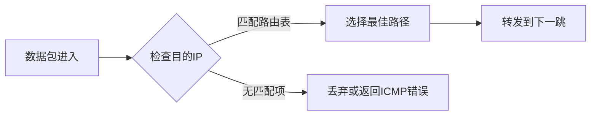
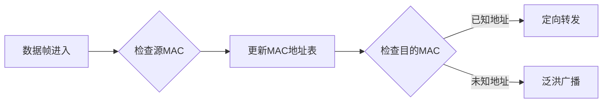

## 基本概念定义

### 路由器（Router）
- **OSI层级**：工作在网络层（第3层）
- **核心功能**：在不同网络之间转发数据包
- **决策依据**：IP地址和路由表
- **典型应用**：连接不同子网或接入互联网

### 交换机（Switch）
- **OSI层级**：传统工作在数据链路层（第2层）
- **核心功能**：在同一网络内转发数据帧
- **决策依据**：MAC地址和交换表
- **典型应用**：局域网内部设备互联

## 核心区别对比

| 特性                | 路由器                          | 交换机                          |
|---------------------|---------------------------------|---------------------------------|
| **工作层级**        | 网络层（L3）                   | 数据链路层（L2）                |
| **寻址方式**        | 基于IP地址                     | 基于MAC地址                    |
| **广播域处理**      | 分隔广播域                     | 转发广播帧                     |
| **连接范围**        | 不同网络之间                   | 同一网络内部                   |
| **功能复杂度**      | 支持NAT、防火墙等高级功能       | 主要做数据帧转发               |
| **典型端口类型**    | WAN口+LAN口                    | 全LAN口                        |
| **协议支持**        | RIP、OSPF、BGP等路由协议       | STP、VLAN等二层协议            |

## 技术原理差异

### 路由器工作原理


### 交换机工作原理


## 功能作用比较

### 路由器的独特作用
1. **网络互联**：连接不同IP子网
2. **路径选择**：通过路由协议计算最优路径
3. **地址转换**：NAT实现私有IP与公有IP转换
4. **安全控制**：ACL、防火墙策略实施

### 交换机的独特作用
1. **冲突域隔离**：每个端口都是独立冲突域
2. **VLAN划分**：逻辑分割广播域
3. **线速转发**：基于硬件的快速帧交换
4. **流量优化**：全双工通信避免冲突

## 典型应用场景

### 需要使用路由器的场景
- 家庭宽带接入互联网
- 企业总部与分支机构互联
- 不同VLAN间通信
- 实施网络安全策略

### 需要使用交换机的场景
- 办公室多台电脑组网
- 数据中心服务器互联
- 网络监控系统部署
- 需要VLAN分割的局域网

## 设备演进与融合

### 三层交换机
- **混合特性**：同时具备交换机和路由器功能
- **实现原理**：
  ```math
  \text{转发决策} = 
  \begin{cases} 
  \text{MAC地址} & \text{同子网通信} \\
  \text{IP地址} & \text{跨子网通信}
  \end{cases}
  ```
- **优势**：保留交换机线速转发能力的同时支持路由功能

### 现代设备发展趋势
1. **家庭网关**：集成路由器、交换机、Wi-Fi功能
2. **SDN技术**：控制平面与数据平面分离
3. **白盒交换机**：可编程数据平面架构

## 配置实例对比

### 路由器基础配置（Cisco IOS）
```cisco
interface GigabitEthernet0/0
 ip address 192.168.1.1 255.255.255.0
!
router ospf 1
 network 192.168.1.0 0.0.0.255 area 0
```

### 交换机基础配置（Cisco IOS）
```cisco
vlan 10
 name Sales
!
interface GigabitEthernet1/0/1
 switchport mode access
 switchport access vlan 10
```

## 选购建议

### 选择路由器的考量因素
1. WAN接口类型（光纤/以太网）
2. NAT吞吐量性能
3. VPN支持能力
4. QoS功能完善度

### 选择交换机的考量因素
1. 背板带宽（bps）
2. 包转发率（pps）
3. VLAN支持数量
4. PoE供电需求

## 常见误区澄清

1. **误区**："交换机就是便宜的路由器"
   - 事实：两者设计目标和应用场景不同，价格取决于端口密度和功能

2. **误区**："有路由器就不需要交换机"
   - 事实：大规模局域网中交换机必不可少，路由器端口数量有限

3. **误区**："三层交换机可以完全替代路由器"
   - 事实：在广域网连接和复杂路由策略上仍需要专用路由器

## 技术演进方向

### 路由器发展方向
- 支持SRv6等新型协议
- 集成AI驱动的流量预测
- 400G/800G高速接口

### 交换机发展方向
- 支持RDMA over Converged Ethernet
- 可编程交换芯片（P4语言）
- 光电混合交换架构

---

总结来说，路由器和交换机是计算机网络中互补的基础设备，虽然现代设备出现功能融合趋势，但理解它们的本质区别对于正确设计网络架构至关重要。在实际组网中，通常需要配合使用这两种设备才能构建完整的网络解决方案。