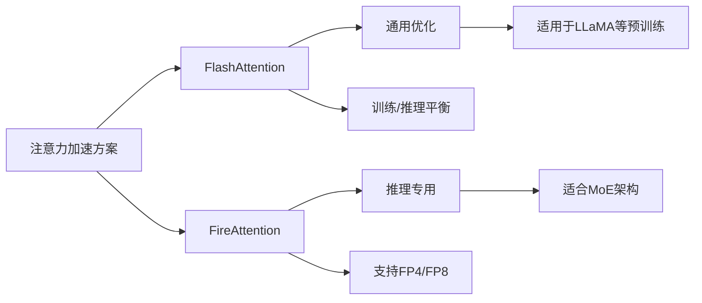

---
aliases:
  - flash attention
creation date: "{{data}}"
---


在人工智能领域，尤其是大语言模型（LLM）和Transformer架构中，注意力机制已成为核心组件。然而，随着模型规模不断扩大和序列长度增加，传统注意力机制面临着严峻的计算效率和内存瓶颈。**FlashAttention**应运而生，作为一种I/O感知的精确注意力算法，它通过**创新性的内存优化策略**，在不牺牲模型质量的前提下，显著提升了注意力计算的速度并大幅降低了内存消耗。本文将深入探讨FlashAttention的定义、原理、实现细节及其在实际中的应用。

## FlashAttention概述
FlashAttention是由Stanford Hazy Research团队提出的高效注意力算法，旨在解决传统注意力机制在处理长序列时的计算瓶颈。其核心创新在于**将I/O（输入/输出）意识引入注意力计算**，通过优化GPU内存层级间的数据流动，实现了2-4倍的速度提升，同时内存消耗仅为传统方法的5%-20%。

传统注意力机制的计算复杂度为$O(N^2d)$，其中$N$是序列长度，$d$是特征维度。当$N$增大时（如处理长文本或高分辨率图像），存储$N \times N$的注意力矩阵会耗尽GPU显存。FlashAttention通过**分块计算（Tiling）** 和**算子融合（Kernel Fusion）** 技术，避免了显存中存储完整的注意力矩阵，将内存复杂度降至$O(N)$。

## 核心原理与数学推导

### 内存层次优化基础
现代GPU包含三级存储结构：
- **HBM（高带宽内存）**：容量大（40-80GB），访问慢（1.5-2TB/s）
- **SRAM（静态随机存储器）**：容量小（约192KB），访问极快（19TB/s）
- **寄存器**：容量最小但速度最快

FlashAttention的核心思想是**将计算尽可能限制在SRAM中**，减少与HBM的数据交换次数。这通过两种关键技术实现：

### 分块计算策略
1. **输入矩阵分块**：
   - 查询矩阵$Q$分为$T_r$块，每块尺寸$B_r \times d$
   - 键$K$和值$V$矩阵分为$T_c$块，每块尺寸$B_c \times d$
   - 典型取值$B_r=64, B_c=64$

2. **局部注意力计算**：
   对每对分块$(Q_i, K_j, V_j)$计算：
   $$
   S_{ij} = Q_iK_j^T \in \mathbb{R}^{B_r \times B_c}
   $$
   该计算完全在SRAM中进行，避免写入HBM

### 在线Softmax算法
传统softmax需两次扫描（计算最大值/求和→计算最终结果），FlashAttention采用**单遍扫描的在线算法**：

1. **局部统计量计算**：
   $$
   \begin{aligned}
   m_{ij} &= \text{rowmax}(S_{ij}) \\
   l_{ij} &= \text{sum}(\exp(S_{ij} - m_{ij}))
   \end{aligned}
   $$

2. **全局统计量更新**：
   当处理新块时，利用softmax的分解性质更新：
   $$
   \begin{aligned}
   m_{\text{new}} &= \max(m_{\text{old}}, m_{ij}) \\
   l_{\text{new}} &= e^{m_{\text{old}} - m_{\text{new}}} \cdot l_{\text{old}} + e^{m_{ij} - m_{\text{new}}} \cdot l_{ij} \\
   O_{\text{new}} &= \frac{e^{m_{\text{old}} - m_{\text{new}}} \cdot l_{\text{old}} \cdot O_{\text{old}} + e^{m_{ij} - m_{\text{new}}} \cdot P_{ij}V_j}{l_{\text{new}}}
   \end{aligned}
   $$
   其中$P_{ij}=\exp(S_{ij}-m_{\text{new}})$

该数学原理允许**增量式更新输出结果**，无需存储完整的$S$矩阵。

### 反向传播优化
FlashAttention采用**重计算策略**：前向传播不保存中间结果，反向传播时按需重新计算。虽然增加了计算量，但显著降低了内存占用。

## 发展演进与技术对比

### 版本迭代
- **FlashAttention v1**：基础版本，训练/推理速度提升2~4倍，兼容性好
- **FlashAttention v2**：优化循环顺序（外循环Q，内循环KV），减少非乘法操作，计算效率达GEMM的50-73%
- **FlashAttention v3**：针对NVIDIA Hopper架构优化，支持Multi-Query Attention和动态KV缓存，推理吞吐提升1.3–1.5倍

### 与传统注意力实现对比

| **特性** | **标准Attention** | **FlashAttention** |
|---------|-----------------|-------------------|
| 显存占用 | $O(N^2)$ | $O(N)$ |
| 并行化程度 | 中等 | 极高 |
| 支持序列长度 | <8k tokens | >32k tokens |
| 计算效率 | 基准 | 提升2-4倍 |
| 中间矩阵存储 | 需要完整$S$和$P$ | 无需存储 |


### 与FireAttention对比


- **FlashAttention**：通用优化，适合长序列训练
- **FireAttention**：专为推理优化，支持低精度计算，适合高吞吐服务场景

## 应用场景与性能优势

### 适用场景
1. **大语言模型训练**：LLaMA、ChatGLM、Phi-3等模型的官方实现已集成
2. **长上下文处理**：支持32k+ tokens的序列（如长文档分析、高分辨率图像）
3. **高并发推理服务**：吞吐量提升2-3倍，延迟降低50%
4. **多模态任务**：视觉-语言联合建模
5. **RAG架构**：加速检索增强生成过程

### 性能表现
| **GPU型号** | **加速比** | **内存节省** |
|------------|-----------|------------|
| A100 | 2–4× | 10–20× |
| RTX 3090 | 2.5–4.5× | 10–20× |
| T4 | 2.5–4.5×（仅前向） | 显著 |


## 实践指南

### 使用方式
**1. 通过HuggingFace Transformers调用**
```bash
pip install transformers accelerate flash-attn --no-build-isolation
```
```python
from transformers import AutoModelForCausalLM

model = AutoModelForCausalLM.from_pretrained("meta-llama/Llama-3-8B", use_flash_attention_2=True)
```

**2. 使用vLLM推理引擎**（自动启用）
```python
from vllm import LLM
llm = LLM(model="meta-llama/Llama-3-8B")  # 自动检测FlashAttention支持
```

**3. 手动CUDA实现核心**
```python
import torch
from flash_attn import flash_attn_func

# q,k,v: [batch_size, seq_len, num_heads, head_dim]
output = flash_attn_func(q, k, v, causal=True)
```

### 调优经验
1. **分块大小选择**：根据GPU架构调整$B_r, B_c$（A100建议$B_r=128, B_c=64$）
2. **精度考量**：FP16/BF16可获得最佳加速，FP8在v3中实验性支持
3. **因果掩码处理**：启用`causal=True`参数避免未来信息泄露
4. **内存监控**：使用`torch.cuda.memory_allocated()`验证显存节省效果

## 最新进展与未来方向
- **动态稀疏注意力**：2024年研究将FlashAttention扩展至稀疏模式
- **多模态优化**：视频-文本联合训练中的3D分块策略
- **量子化支持**：FP8/FP4的完整支持（FireAttention已实现）
- **跨平台适配**：AMD MI300和下一代AI芯片的适配优化
https://pytorch.ac.cn/blog/flashattention-3/


## 推荐资源
1. **原始论文**：https://arxiv.org/abs/2205.14135
2. **官方实现**：https://github.com/Dao-AILab/flash-attention
3. **教程资源**：
   - https://zhuanlan.zhihu.com/p/639228228
   - https://blog.csdn.net/jx232515/article/details/148906411
4. **实践课程**：HuggingFace出品的《高效Transformer实现》实战课

FlashAttention已成为大模型时代的**基础设施级创新**，它解决了注意力计算的I/O瓶颈，使训练更长上下文、更大规模的模型成为可能。随着v3版本的发布和生态的成熟，这项技术将继续推动AI模型的能力边界扩展。

> 人类注意力是有限的，但机器注意力可以无限优化 —— Flash-AI的演进正是对这一理念的最佳诠释。