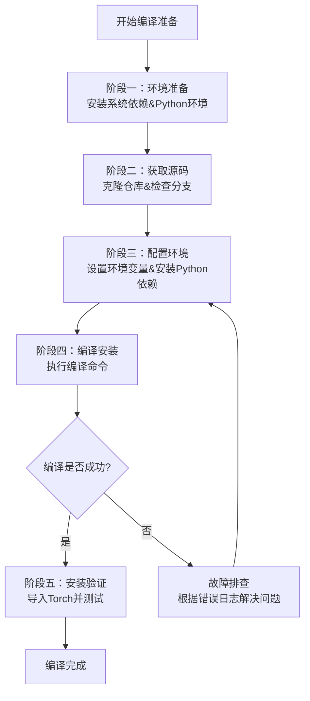

从源码手动编译 PyTorch 可以让你获得与当前环境（特别是 CUDA 12.4）高度兼容的定制版本。下面我将为你详细阐述编译 PyTorch 2.5 版本的完整流程、关键配置以及常见问题的处理方法。

下图清晰地展示了从准备到验证的完整编译流程，你可以通过它了解整个工作的全景。



# 🔧 PyTorch 2.5 源码编译指南 (适配 CUDA 12.4)

## 编译流程详解

### 阶段一：环境准备
首先需要安装必要的系统依赖库和工具，这是编译成功的基础。

1.  **更新系统包管理器并安装基础编译工具**
    ```bash
     apt update &&  apt upgrade -y
     apt install -y build-essential cmake cmake-curses-gui git ninja-build
    ```

2.  **安装关键的数学库**
    PyTorch 高度依赖这些库进行数值计算加速。
    ```bash
     apt install -y libopenblas-dev libopenblas-base libatlas-base-dev libblas-dev
    ```

3.  **安装其他运行时库**
    ```bash
     apt install -y libffi-dev libjpeg-dev libpng-dev libxml2-dev
    ```

4.  **确保 Python 环境就绪**
    假设你已安装 Python 3.8 或更高版本。需要安装 `pip`、`virtualenv` 并创建独立的虚拟环境，以避免与系统包发生冲突。
    ```bash
     apt install -y python3-pip python3-venv
    python3 -m venv pytorch-build
    source pytorch-build/bin/activate
    pip install --upgrade pip setuptools wheel
    ```

### 阶段二：获取源码
使用 Git 克隆 PyTorch 仓库并切换到你需要编译的特定版本分支。对于 PyTorch 2.5，应使用 `v2.5.0` 标签。

1.  **克隆仓库（包含子模块）**
    PyTorch 依赖一些子项目（Submodules），必须递归克隆。
    ```bash
    git clone --recursive https://github.com/pytorch/pytorch.git
    cd pytorch
    ```

2.  **切换到 v2.5.0 标签**
这确保了编译的是稳定的 2.5 版本，而不是处于开发中的最新代码。
```bash
git checkout v2.5.0
git submodule update --init --recursive # 确保子模块版本同步
```

### 阶段三：配置环境
正确的环境变量配置是编译成功的关键，尤其是在指定 CUDA 版本时。

1.  **设置关键环境变量**
    将以下命令粘贴到终端执行，或在 shell 配置文件（如 `~/.bashrc`）中设置以便在多次编译会话中生效。

```bash
# 最重要的：指明使用 CUDA 12.4
export USE_CUDA=1
export USE_CUDNN=1
export USE_NCCL=1

# 指定 CUDA 工具包路径（如果安装在不同位置，请修改）
export CUDA_HOME=/usr/local/cuda-12.4
export PATH=${CUDA_HOME}/bin:${PATH}
export LD_LIBRARY_PATH=${CUDA_HOME}/lib64:${LD_LIBRARY_PATH}

# 优化和性能相关设置
export USE_FBGEMM=1       # Facebook 的通用矩阵乘法库
export USE_KINETO=1       # 性能分析支持
export USE_OPENMP=1       # 启用 OpenMP 多线程
export USE_MKLDNN=1       # Intel CPU 加速库

# 针对树莓派或低内存设备的优化（非必需，但可参考）
# export MAX_JOBS=2 # 限制并行编译任务数，减少内存消耗
# export NO_CUDA=0 # 明确不禁用 CUDA
```

    **注意**：请再次确认 `CUDA_HOME` 的路径与你系统中 CUDA 12.4 的实际安装路径一致。你可以使用 `which nvcc` 命令来辅助判断。

2.  **安装 Python 依赖**
    在 PyTorch 源码根目录下，安装编译和运行时必需的 Python 包。
    ```bash
    pip install -r requirements.txt
    # 通常还需要单独安装一些基础库
    pip install numpy pyyaml typing-extensions
    ```

### 阶段四：编译与安装
一切就绪后，开始编译。这个过程会非常耗时，取决于你的硬件配置。

1.  **使用 setup.py 进行编译安装**
    这是最常用的方法，它会执行编译并将生成的 PyTorch 包安装到你的 Python 环境中（这里是虚拟环境）。
    ```bash
    python setup.py install
    ```

    **加速编译的技巧**：
    *   **并行编译**：使用 `-j` 参数指定并行任务数，通常设置为 CPU 核心数，可以显著缩短时间。
        ```bash
        python setup.py install --cmake-only
        python setup.py install -j$(nproc) # $(nproc) 会自动获取CPU核心数
        ```
    *   **使用 Ninja**：Ninja 是一个比 `make` 更快的构建系统。确保已安装 `ninja-build`，CMake 通常会自动检测并使用它。

2.  **（可选）生成 Wheel 包**
    如果你希望将编译好的 PyTorch 分发给其他相同环境的机器，可以编译成 `.whl` 文件。
    ```bash
    python setup.py bdist_wheel
    ```
    编译完成后，Wheel 包会生成在 `dist/` 目录下，你可以使用 `pip install dist/torch-2.5.0+cu124-cp3xx-linux_x86_64.whl` 来安装它。

### 阶段五：验证安装
编译安装完成后，务必进行验证以确保 PyTorch 工作正常，且能正确识别你的 CUDA 环境。

1.  激活你的虚拟环境（如果尚未激活）：`source pytorch-build/bin/activate`
2.  启动 Python 解释器：`python`
3.  在 Python 中执行以下命令：

    ```python
    import torch
    print("PyTorch 版本:", torch.__version__)
    print("CUDA 是否可用:", torch.cuda.is_available())
    print("CUDA 版本:", torch.version.cuda)
    print("当前 GPU 设备:", torch.cuda.current_device())
    print("GPU 设备名称:", torch.cuda.get_device_name(0))
    ```

    **期望的输出**：
    *   `PyTorch 版本:` 应以 `2.5.0` 或类似开头。
    *   `CUDA 是否可用:` 必须为 `True`。
    *   `CUDA 版本:` 应显示为 `12.4`。

    如果 `CUDA 是否可用` 显示为 `False`，请检查之前的步骤，特别是环境变量 `CUDA_HOME` 的设置是否正确，以及系统中 CUDA 12.4 的驱动和运行时库是否完好。

## 💡 常见问题与解决方案

*   **编译时间过长或内存不足**
    *   **问题**：在资源有限的机器上，编译可能因内存不足而失败。
    *   **解决**：
        1.  减少并行任务数：执行 `export MAX_JOBS=2`（数字根据你的内存大小调整，例如 4GB 内存可设为 2）。
        2.  临时增加交换空间（Swap）：
            ```bash
             swapoff /swapfile # 如果已有交换文件，先关闭
             dd if=/dev/zero of=/swapfile bs=1G count=8 # 创建8GB交换文件
             chmod 600 /swapfile
             mkswap /swapfile
             swapon /swapfile
            ```
        3.  编译完成后，可关闭交换空间：` swapoff /swapfile`。

*   **编译过程中出错**
    *   **解决**：
        1.  **查看详细错误日志**：错误信息通常会指示缺失的依赖或配置问题。仔细阅读终端输出的最后几行错误信息。
        2.  **确保所有依赖已安装**：回头检查“环境准备”部分是否有遗漏的包。
        3.  **尝试先进行 CMake 仅配置**：运行 `python setup.py build --cmake-only` 可以帮助提前发现一些配置问题。

## 💎 总结
通过以上步骤，你应该能够在 CUDA 12.4 环境下成功编译出 PyTorch 2.5。手动编译虽然耗时，但能确保与你的特定环境达到最佳兼容性。如果在过程中遇到问题，PyTorch 的官方 GitHub Wiki 和论坛也是宝贵的求助资源。

希望这份详细的指南能帮助你顺利完成编译！