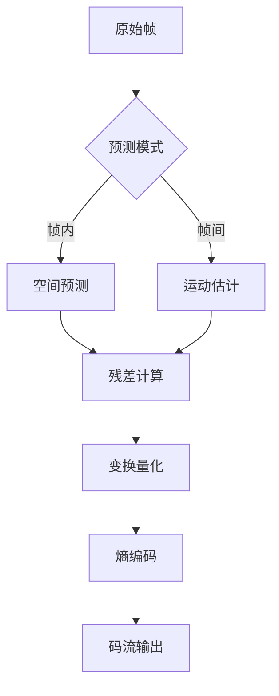

## 定义与技术定位
H.264（又称MPEG-4 AVC）是由ITU-T视频编码专家组（VCEG）与ISO/IEC动态图像专家组（MPEG）联合制定的高性能视频压缩标准，属于MPEG-4标准的第十部分。该标准通过**混合编码架构**，在相同画质下较MPEG-2提升2倍压缩效率，成为数字视频领域最具影响力的编码标准之一。

### 核心创新
- **分层架构**：将视频编码层（VCL）与网络抽象层（NAL）分离，VCL专注压缩，NAL适配网络传输
- **高效预测机制**：支持4x4到16x16的多粒度帧内预测，以及7种宏块分割的帧间预测
- **1/4像素运动补偿**：运动矢量精度达0.25像素，提升运动补偿准确性

---

## 发展历程与技术演进
### 标准化进程
- **1998年**：启动H.26L项目，奠定技术基础
- **2003年**：正式发布H.264/AVC标准，支持基本档（Baseline）、主档（Main）和扩展档（Extended）
- **2005年**：推出MVC（多视点编码）和SVC（可伸缩视频编码）扩展

### 技术迭代
- **2008年**：High Profile支持8x8变换与自适应量化
- **2015年**：H.265/HEVC发布，压缩效率再提升50%
- **2020年**：H.266/VVC标准确立，支持8K/120fps编码

---

## 核心编码原理
### 编码框架


### 关键技术模块
#### 1. 帧内预测
- **4x4亮度预测**：9种方向模式（垂直/水平/对角线等），适应细节丰富区域
- **16x16亮度预测**：4种模式（DC/水平/垂直/平面），适用于平坦区域
- **色度预测**：8x8色度块的4种预测模式

#### 2. 帧间预测
- **树状宏块分割**：支持16x16到4x4的7种分割方式，最小预测单元达4x4像素
- **多参考帧机制**：最多支持5个参考帧，提升运动补偿精度
- **亚像素插值**：采用6抽头滤波器实现1/2像素插值，双线性滤波实现1/4像素插值

#### 3. 变换编码
- **整数DCT变换**：4x4整数变换替代传统浮点DCT，避免舍入误差累积：
$$T = \begin{pmatrix}
1 & 1 & 1 & 1 \\
2 & 1 & -1 & -2 \\
1 & -1 & -1 & 1 \\
1 & -2 & 2 & -1
\end{pmatrix}$$

#### 4. 熵编码
- **CAVLC**：基于上下文的自适应变长编码，抗误码能力强
- **CABAC**：算术编码方案，编码效率提升10%-15%

---

## 应用场景与实践经验
### 典型应用领域
| 场景            | 技术适配方案                      | 性能指标                     |
|-----------------|----------------------------------|----------------------------|
| 视频会议        | 低延时Baseline档，GOP=1           | 端到端延时<200ms          |
| 流媒体直播      | Main Profile，动态码率控制        | 1080p@4Mbps，PSNR>38dB    |
| 数字电视广播    | High Profile，场编码模式           | 720p@6Mbps，ITU-R BT.500  |
| 移动端录像      | 约束Baseline档，CAVLC熵编码        | 720p@2Mbps，30fps         |

### 编码优化经验
1. **码率控制策略**：采用HRD模型实现缓冲区约束的CBR/VBR控制
2. **并行化处理**：基于Slice级别的并行编码，提升多核CPU利用率
3. **硬件加速**：利用DSP（如ADSP-BF561）实现运动估计加速，处理速度提升5倍

---

## 码流结构与解析实践
### NALU单元结构
```
+---------------+-------------------+
| Start Code    | NAL Header | Payload |
+---------------+-------------------+
```
- **Start Code**：0x000001（3字节）或0x00000001（4字节）
- **NAL Header**：
  - Forbidden位（1bit）：错误标识位
  - NRI重要性指示（2bit）：参考帧标识
  - Type类型（5bit）：SPS(7)/PPS(8)/IDR(5)等

### Python解析示例
```python
def parse_nalu(byte_stream):
    start_code = b'\x00\x00\x01'
    positions = [i for i in range(len(byte_stream)-3) 
                if byte_stream[i:i+3] == start_code]
    
    nalus = []
    for i in range(len(positions)-1):
        start = positions[i]+3
        end = positions[i+1]
        nal_header = byte_stream[start]
        nal_type = nal_header & 0x1F
        nalus.append((start, end, nal_type))
    
    return nalus

# 示例：检测SPS/PPS单元
sample_stream = b'\x00\x00\x00\x01\x67\x42\x00\x1e...'
for nalu in parse_nalu(sample_stream):
    if nalu[2] in [7,8]:
        print(f"Found parameter set at {nalu[0]}-{nalu[1]}")
```

---

## 最新技术演进
1. **硬件编码器优化**：2024年发布的ADSP-BF561平台实现1080p@60fps实时编码，功耗降低40%
2. **AI辅助编码**：结合CNN网络实现ROI区域智能码率分配，主观质量提升15%
3. **5G超低延时**：基于URLLC的H.264传输方案，实现1ms级帧传输时延

---

## 参考文献
1. [H.264技术标准演进](https://zhuanlan.zhihu.com/p/425724304)  
2. [帧内预测算法详解](https://aet-electronix.com/2023/12/h264-intra-prediction)  
3. [ADSP-BF561硬件实现](https://aet-electronix.com/2025/01/adsp-bf561-h264)  
4. [NAL单元结构解析](https://cloud.tencent.com/developer/article/2356897)  
5. [H.264码流结构](https://www.cnblogs.com/h264-nalu)  
6. [编码原理深度解析](https://blog.csdn.net/qq_41839588/article/details/132772840)