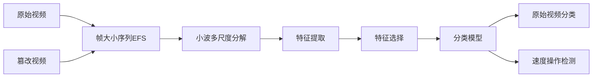

## 分层等级的含义

小波分解中的分层等级(Level)表示对信号的多分辨率分析层次：
1. **层次结构**：第一层(Level1)捕捉最高频率的细节，随着层级增加，分析对象逐步转为低频成分
2. **时间-频率局域化**：高级分解在时间上更粗粒度，频率上更低频
3. **特征尺度**：不同层级对应不同时间尺度(从毫秒到秒)的特征
4. **信息粒度**：低级层次捕捉细节变化，高级层次捕捉整体趋势

在视频分析中：
- Level1-2：捕捉帧间微小变化（如物体运动）
- Level3-4：分析场景变化（如镜头切换）
- Level5+：检测长期模式（如周期性速度操作痕迹）

## 小波变换结果的物理意义

小波系数在不同层级代表不同的视频特征：

| 系数类型 | 物理意义 | 在视频分析中的对应 |
|---------|---------|-------------------|
| **细节系数(D)** | 高频成分，代表快速变化 | 帧间的快速变化，速度操作的干扰信号 |
| **近似系数(A)** | 低频成分，代表缓慢变化 | 视频内容的整体趋势，场景变换 |
| **D1系数** | 最高频细节 | 单个帧的变化，编码噪声 |
| **D2系数** | 次高频细节 | 短时(2-4帧)模式，轻微速度操作痕迹 |
| **D3-D5系数** | 低频细节 | 速度操作的周期性特征(关键检测目标) |

在视频速度操作检测中：
- **周期性特征**：速度操作会在特定频带(D3-D5)引入周期性干扰
- **能量异常**：速度操作区域的小波系数能量分布异于正常视频
- **统计特性变化**：系数均值、方差、极值分布异常

## 基于特征的分类方法

### 1. 特征提取流程
```python
def extract_video_features(video_path):
    # 步骤1：提取帧大小序列(EFS)
    efs, frame_types = extract_efs_ffprobe(video_path)
    
    # 步骤2：自适应小波分解
    max_level = pywt.dwt_max_level(len(efs), wavelet.dec_len)
    level = min(5, max_level)  # 最大5层
    coeffs = pywt.wavedec(efs, 'db4', level=level) if level > 0 else []
    
    # 步骤3：提取多级特征
    features = []
    if coeffs:
        # 能量特征（各层细节系数能量）
        for i in range(1, len(coeffs)):
            energy = np.sum(coeffs[i]**2) / len(coeffs[i])
            features.append(energy)
        
        # 频谱特征（中间层的周期性）
        mid_coeff = coeffs[len(coeffs)//2]
        fft = np.abs(np.fft.rfft(mid_coeff)[1:])  # 忽略DC分量
        features.extend([np.max(fft), np.mean(fft), np.std(fft)])
        
        # 统计特征（中高层细节系数）
        high_coeffs = np.concatenate(coeffs[-2:])
        if len(high_coeffs) > 10:  # 确保足够样本
            features.extend([
                np.mean(high_coeffs),
                np.std(high_coeffs),
                np.max(high_coeffs),
                np.min(high_coeffs),
                stats.skew(high_coeffs)
            ])
    
    # 步骤4：补充序列统计特征
    features.extend([
        np.mean(efs),
        np.std(efs),
        stats.kurtosis(efs),
        len(efs)  # 视频长度特征
    ])
    
    return np.array(features)
```

### 2. 分类系统设计



**特征选择方法**：
1. 递归特征消除(RFE)：基于模型重要性筛选特征
2. 相关性分析：选择与速度操作相关度高的特征
3. 主成分分析(PCA)：降维减少特征冗余

**分类模型选择**：
```python
from sklearn.ensemble import RandomForestClassifier
from sklearn.svm import SVC
from xgboost import XGBClassifier

# 集成分类器
class SpeedManipulationDetector:
    def __init__(self):
        self.models = {
            'rf': RandomForestClassifier(n_estimators=100),
            'svm': SVC(probability=True, kernel='rbf'),
            'xgb': XGBClassifier(n_estimators=150)
        }
        self.ensemble_weight = [0.4, 0.3, 0.3]  # 模型权重
    
    def predict(self, features):
        predictions = []
        for model in self.models.values():
            predictions.append(model.predict_proba([features])[0])
        
        # 加权集成
        final_prob = np.zeros(2)  # 2类：[原始, 篡改]
        for i, prob in enumerate(predictions):
            final_prob += self.ensemble_weight[i] * prob
        
        return 1 if final_prob[1] > 0.6 else 0  # 篡改概率阈值
```

### 3. 系统优化策略

1. **自适应小波分解**：
   ```python
   def adaptive_wavelet_decompose(efs, max_level=5):
       n = len(efs)
       if n < 32:
           level = min(3, pywt.dwt_max_level(n, pywt.Wavelet('db4').dec_len))
       elif n < 128:
           level = 4
       else:
           level = 5
       return pywt.wavedec(efs, 'db4', level=level)
   ```

2. **关键特征增强**：
   - 对检测速度操作敏感的D3-D5层系数进行功率谱密度分析
   - 对速度操作相关的周期性特征进行傅里叶变换增强
   - 对帧类型模式(I/P/B帧分布)进行特征融合

3. **迁移学习**：
   ```python
   def transfer_learning(base_model, new_data):
       # 冻结基础层
       for layer in base_model.layers[:-3]:
           layer.trainable = False
       
       # 微调顶层
       base_model.fit(new_data, epochs=20, learning_rate=0.0001)
       return base_model
   ```

## 结语

通过小波多尺度分析，我们可以从不同层次捕捉视频速度操作的痕迹：
1. **低级特征**：快速变化模式检测轻微速度操作
2. **中级特征**：周期性分析检测规律的加速/减速
3. **高级特征**：整体模式识别大幅速度修改

结合机器学习和深度学习技术，这种多尺度特征方法能够有效区分原始视频与经过速度操作处理的视频，为视频真伪鉴定提供可靠的技术手段。