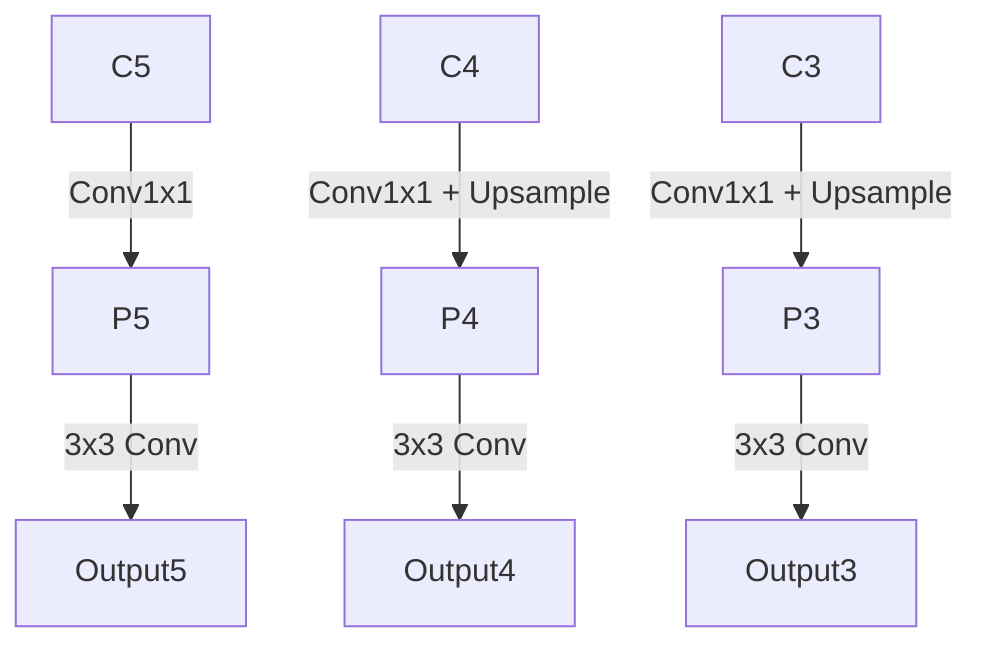

#cnn #fpn

## 定义
**特征金字塔网络（Feature Pyramid Network, FPN）**是一种用于解决目标检测、实例分割等计算机视觉任务中**多尺度问题**的深度学习架构。其核心思想是通过构建具有**横向连接（lateral connections）**的金字塔结构，将深层网络的语义信息与浅层网络的几何信息融合，实现高效的多尺度特征表示。数学表达为：

$$
P_i = \text{Conv}_{1\times1}(C_i) + \text{Upsample}(P_{i+1})
$$

其中$P_i$表示第$i$层金字塔特征，$C_i$为对应层的主干网络特征。

## 发展历史
- **2014年前**：传统图像处理采用手工构建金字塔（如SIFT特征）
- **2015年**：Faster R-CNN等模型使用单一高层特征图，忽视多尺度信息
- **2017年**：FAIR团队在论文[《Feature Pyramid Networks for Object Detection》](https://arxiv.org/abs/1612.03144)首次提出FPN架构
- **2018年后**：衍生出PANet、BiFPN等改进结构，成为现代检测器的标准组件

## 原理详解
### 基础结构


1. **自顶向下路径**：从深层特征图（高语义）逐步上采样
2. **横向连接**：通过1×1卷积对齐通道数后相加
3. **特征增强**：每个融合后的特征图经过3×3卷积消除混叠效应

![[Pasted image 20250408234344.png]]

### 数学表达
对于主干网络特征$\{C_2,C_3,C_4,C_5\}$，FPN输出为：

$$
\begin{cases}
P_5 = \text{Conv}_{1\times1}(C_5) \\
P_i = \text{Conv}_{1\times1}(C_i) + \text{Upsample}(P_{i+1}),\ i=4,3,2 \\
\text{Output}_i = \text{Conv}_{3\times3}(P_i)
\end{cases}
$$

## 适用场景
| 任务类型       | 典型模型          | FPN作用                     |
|----------------|-------------------|-----------------------------|
| 目标检测       | Faster R-CNN      | 提升小目标检测AP            |
| 实例分割       | Mask R-CNN        | 生成高质量ROI特征           |
| 关键点检测     | PoseNet           | 跨尺度关节定位              |
| 语义分割       | DeepLab系列       | 增强边缘细节                |

## 实践经验
1. **通道数配置**：通常设置256通道（平衡计算量与效果）
2. **上采样方法**：双线性插值比转置卷积更稳定
3. **训练技巧**：
   - 从浅层到深层逐步解冻训练
   - 使用GN（Group Normalization）替代BN

## PyTorch实现核心代码
```python
import torch.nn as nn

class FPN(nn.Module):
    def __init__(self, backbone_channels=[256,512,1024,2048], out_channels=256):
        super().__init__()
        # 横向连接的1x1卷积
        self.lateral_convs = nn.ModuleList([
            nn.Conv2d(ch, out_channels, 1) for ch in backbone_channels
        ])
        # 输出卷积
        self.output_convs = nn.ModuleList([
            nn.Conv2d(out_channels, out_channels, 3, padding=1) 
            for _ in backbone_channels
        ])
        
    def forward(self, features):
        # features: [C2,C3,C4,C5]
        pyramid = [self.lateral_convs[-1](features[-1])]
        
        for i in range(len(features)-2, -1, -1):
            pyramid.append(
                F.interpolate(pyramid[-1], scale_factor=2) + 
                self.lateral_convs[i](features[i])
            )
            
        return [self.output_convs[i](p) for i,p in enumerate(reversed(pyramid))]
```

## 改进方向
1. **加权特征融合**：如BiFPN引入可学习权重
   $$
   P_i^{out} = \frac{w_1\cdot C_i + w_2\cdot \text{Upsample}(P_{i+1})}{w_1+w_2+\epsilon}
   $$
2. **跨尺度动态卷积**：如CARAFE算子
3. **轻量化设计**：深度可分离卷积替代标准卷积

## 参考文献
- [FPN原始论文](https://arxiv.org/abs/1612.03144)
- [MMDetection实现](https://github.com/open-mmlab/mmdetection)
- [Torchvision官方教程](https://pytorch.org/vision/stable/feature_extraction.html)
