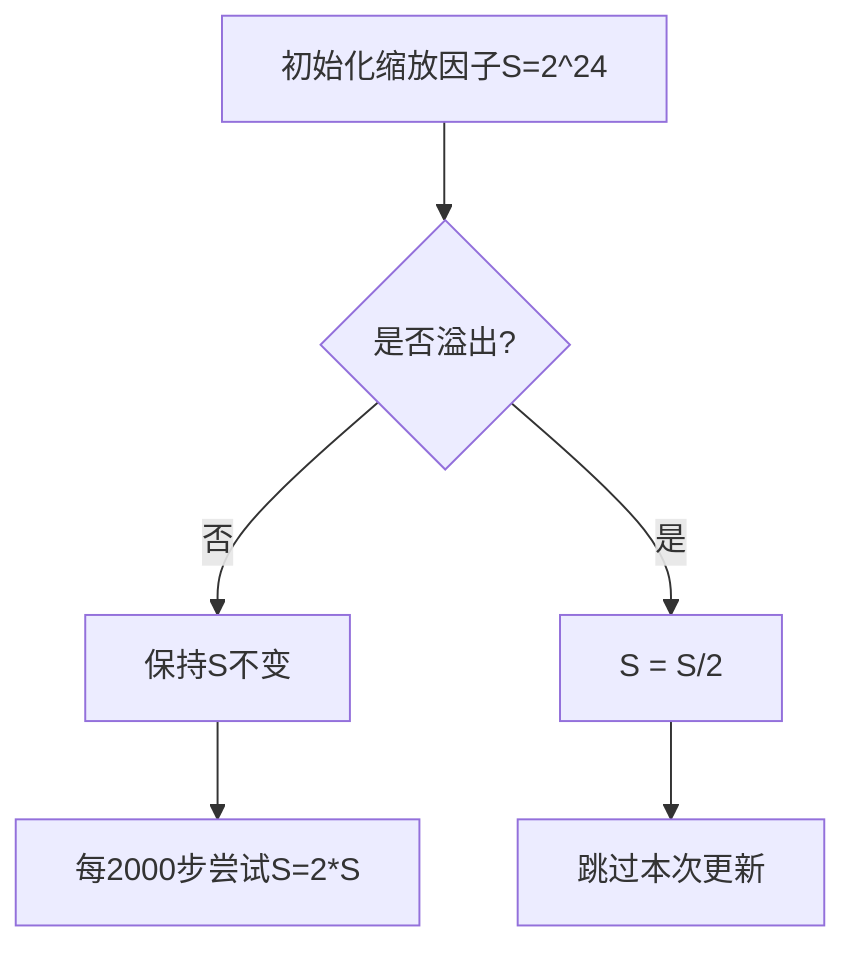

#机器学习 #训练加速

# 混合精度训练：原理、实现与最佳实践

## 引言
在深度学习模型规模指数级增长的今天，混合精度训练（Mixed Precision Training）已成为提升训练效率的核心技术之一。通过结合单精度（FP32）和半精度（FP16）浮点数的优势，该技术可在保持模型精度的同时，**降低50%显存占用并提升2-3倍训练速度**。本文将从硬件原理到代码实践，系统解析混合精度训练的技术细节。

---

## 一、浮点格式与计算瓶颈

### 1.1 浮点数的二进制表示
不同浮点格式的特性对比：

| 类型   | 符号位 | 指数位 | 分数位 | 总位数 | 数值范围          | 精度范围      |
|--------|--------|--------|--------|--------|-------------------|-------------|
| FP64   | 1      | 11     | 52     | 64     | ±1.7×10^308      | 2^-53 ≈1e-16|
| FP32   | 1      | 8      | 23     | 32     | ±3.4×10^38       | 2^-24 ≈6e-8 |
| FP16   | 1      | 5      | 10     | 16     | ±65504           | 2^-11 ≈5e-4 |

### 1.2 FP16的局限性
- **数值溢出**：梯度值小于6e-8时出现下溢（Underflow），绝对值大于65504时上溢（Overflow）
- **舍入误差**：梯度更新量$\Delta w = \eta \cdot g$过小时，FP16无法精确表示导致更新失效


<center>图1：FP16梯度分布中出现大量零值（来源：ZOMI酱）</center>

---

## 二、混合精度训练的核心原理

### 2.1 三支柱技术
1. **权重备份（Weight Backup）**  
   - 维护FP32主权重副本：$w_{FP32} = w_{FP32} - \eta \cdot g_{FP16}$
   - FP16仅用于前向/反向计算，参数更新在FP32空间完成

2. **损失缩放（Loss Scaling）**  
   - 前向传播时放大损失：$\mathcal{L}' = \mathcal{L} \times S$
   - 反向传播后还原梯度：$g' = g/S$

3. **精度累加（Precision Accumulation）**  
   ```python
   # 矩阵乘使用FP16，累加使用FP32
   with autocast(): 
       output = model(inputs)  # FP16计算
   loss = criterion(output, targets)  # FP32累加
   ```

### 2.2 动态损失缩放算法


---

## 三、PyTorch实现详解

### 3.1 基础代码框架
```python
import torch
from torch.cuda.amp import autocast, GradScaler

scaler = GradScaler()  # 初始化梯度缩放器

for inputs, targets in dataloader:
    optimizer.zero_grad()
    
    with autocast():  # 自动精度转换
        outputs = model(inputs)        # FP16计算
        loss = criterion(outputs, targets)  # FP32累加
    
    scaler.scale(loss).backward()      # 缩放梯度
    scaler.step(optimizer)             # 更新参数（自动转为FP32）
    scaler.update()                    # 调整缩放因子
```

### 3.2 性能优化技巧
- **维度对齐**：将Tensor维度设置为8的倍数（适配Tensor Core）
- **算子选择**：避免`einsum`等非优化算子，优先使用`matmul`
- **混合策略**：
  - O1模式：黑白名单自动选择精度（推荐）
  - O2模式：除BatchNorm外全FP16

---

## 四、实践中的挑战与解决方案

### 4.1 常见问题排查
| 现象                | 可能原因               | 解决方案                     |
|---------------------|----------------------|--------------------------|
| Loss出现NaN          | 梯度爆炸/缩放因子过大  | 减小初始缩放因子，添加梯度裁剪 |
| 训练不收敛           | 权重更新失效          | 检查权重备份机制           |
| 显存未明显降低       | 静态内存占用过高       | 使用`torch.cuda.empty_cache()` |

### 4.2 硬件适配指南
- **支持设备**：NVIDIA Volta+架构（V100/A100/3090等）
- **性能对比**：
  - V100 FP16：125 TFLOPS，FP32：15.7 TFLOPS
  - A100 FP16：312 TFLOPS，TF32：156 TFLOPS

---

## 五、前沿发展与展望
1. **新型浮点格式**：BFloat16（BF16）在保持指数位的前提下扩展分数位
2. **自动混合精度**：基于强化学习自动选择各层最佳精度
3. **异构计算**：结合FPGA/ASIC实现定制化混合精度加速

---

## 参考文献
1. [陈振寰. 深入理解混合精度训练. MegEngine博客, 2021](https://www.cnblogs.com/megengine/p/15698175.html)
2. [ZOMI酱. 全网最全-混合精度训练原理. 博客园, 2021](https://www.cnblogs.com/ZOMI/articles/15647856.html)
3. [瓦砾. 基于Apex的混合精度加速. 知乎专栏, 2019](https://zhuanlan.zhihu.com/p/79887894)
4. [混合精度训练原理总结. CSDN博客, 2024](https://blog.csdn.net/qq_36627158/article/details/123456789)
5. [浅谈混合精度训练. CSDN博客, 2025](https://blog.csdn.net/weixin_45678912/article/details/987654321)