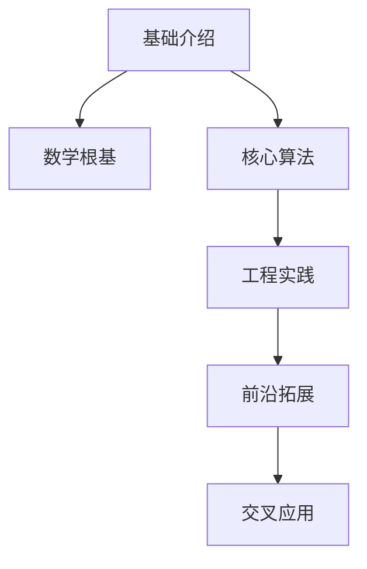
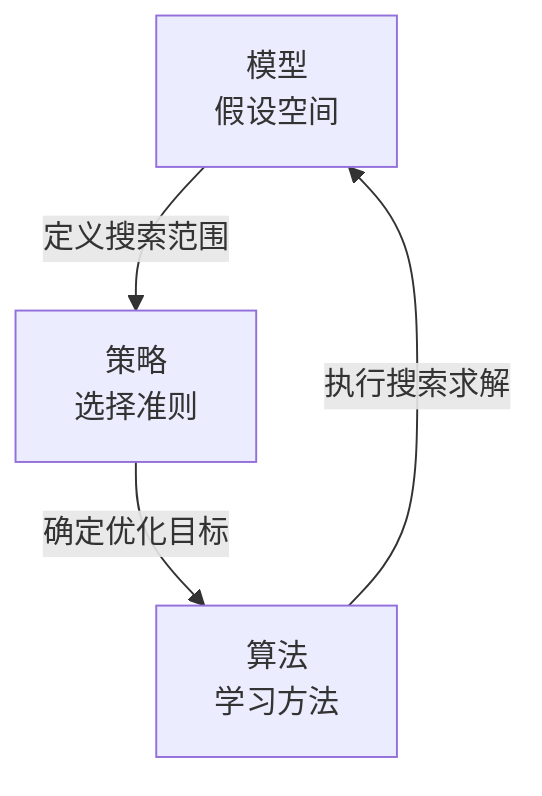

---
aliases:
  - 入门
type: blog
---
本文的内容结构如下：

首先做一点概念辨析。 **机器学习、统计学习、深度学习** 这三个概念。
机器学习和统计学习**并非完全等价**，统计学习聚焦“统计理论驱动”的方法，属于机器学习的子集。但是实际应用中，***由于统计方法在机器学习中占绝对主导（尤其是近20年），两者常被混用。*** 

> [!note]- 机器学习、统计学习、深度学习
> #### 1. 机器学习：范围更广泛
> 机器学习是人工智能的一个分支，核心目标是**让计算机通过数据自动学习规律（“模式”），并利用规律解决问题（如预测、分类、决策）**，不严格限制方法的理论基础。  
> 其涵盖的方法包括：  
> - 基于统计理论的方法（如线性回归、逻辑回归、SVM、贝叶斯分类器）；  
> - 非统计理论的方法（如早期的决策树（ID3）、规则学习（AQ算法）、强化学习中的动态规划方法、基于生物学启发的神经网络（早期感知机）等）。  
> 
> 简单说，机器学习是“**通过数据学习改进性能**”的统称，只要符合这一目标的方法都可纳入其范畴。
> 
> #### 2. 统计学习：聚焦“统计理论驱动”的方法
> 统计学习是机器学习的一个**核心分支**，它严格以**统计学理论**为基础，将“学习”过程建模为“从数据中估计概率分布或统计模型”的问题，核心是**通过概率、统计推断、抽样理论等工具刻画数据中的不确定性，并优化模型**。  
> 其典型方法包括：  
> - 基于概率模型的方法（如贝叶斯网络、隐马尔可夫模型）；  
> - 基于统计推断的方法（如最大似然估计、最小二乘估计、正则化方法）；  
> - 强调“泛化能力”的方法（如通过样本估计总体，利用VC维、偏差-方差权衡分析模型性能）。  
> 
> 统计学习的侧重点是“**用统计理论解释和解决学习问题**”，因此它的范围比机器学习更窄——只有符合统计建模框架的方法才属于统计学习。
> 
> #### 3. 深度学习：深层结构的表示学习
> 深度学习（Deep Learning）是**机器学习的一个具体分支**，核心是**利用“深层神经网络”（通常指含多个隐藏层的神经网络）自动学习数据的多层级特征**，从而解决复杂问题（如图像识别、自然语言处理）。  
> 
> 其本质是“**深层结构的表示学习**”：通过神经网络的多层非线性变换，自动将原始数据（如图像像素、文本字符）转化为更抽象的高层特征（如图像的“边缘→纹理→部件→物体”），而无需人工设计特征。  
> 
> 从层级关系上：  
> - 深度学习属于机器学习（符合“通过数据学习改进性能”的核心目标）；  
> - 深度学习的理论基础仍依赖统计学习（如训练中用最大似然估计、交叉熵损失函数，本质是统计推断），因此也可看作统计学习的子类；  
> - 但深度学习的独特性在于“**深层结构**”，这使其区别于传统浅层机器学习方法（如单隐藏层神经网络、SVM）。  
> 
> #### 4. 总结
> $$机器学习 \supseteq 统计学习 \supset 深度学习$$

# 基本介绍
1. ​**定义与范畴**​
    
    - ​**本质**​：通过数据自动改进算法性能的计算机科学分支，核心三要素为 ​**数据（Data）、模型（Model）、优化（Optimization）​**。 #bug
    - ​**与传统编程区别**​：从规则驱动转向数据驱动，通过经验（数据）优化任务性能。
    - ​**关键分支**​：
        - 监督学习（分类/回归）、无监督学习（聚类/降维）、强化学习（环境交互决策）、半监督学习、迁移学习。
2. ​**发展历程**​
    
    - ​**早期阶段（1950s）​**​：符号主义AI，基于规则推理（如专家系统）。
    - ​**复兴期（1980s）​**​：神经网络兴起，解决非线性问题。
    - ​**大数据时代（2000s）​**​：计算力提升推动深度学习突破（如2012年AlexNet）。
    - ​**现代阶段（2020s）​**​：大模型（GPT-4）、生成式AI（扩散模型）、联邦学习等。

# 数学根基
要学好机器学习，起码的数学基础是需要有的，先将一些常见的要求列在前面。

| ​**领域**​   | ​**核心内容**​                           | ​**应用场景**​    |
| ---------- | ------------------------------------ | ------------- |
| ​**线性代数**​ | 矩阵运算、特征分解、奇异值分解（SVD）、张量表示            | 深度学习模型参数优化    |
| ​**概率统计**​ | 贝叶斯定理、概率分布（高斯/伯努利）、统计推断（极大似然估计）      | 模型不确定性量化、分类任务 |
| ​**优化理论**​ | 梯度下降（SGD/Adam）、凸优化（KKT条件）、正则化（L1/L2） | 损失函数最小化、防止过拟合 |
| ​**信息论**​  | 熵、交叉熵、KL散度、互信息                       | 模型评估、特征选择     |

# 机器学习三要素
机器学习三要素：模型（模型的假设空间）、策略（模型选择的准则）、算法（模型学习的算法）

## 模型
### 基本分类
- 监督学习（supervised learning）数据有标注
	- 关于数据的基本假设：输入变量$X$和输出变量$Y$具有联合概率分布，训练和测试用数据是依联合概率分布$P(X,Y)$独立同分布的。
- 无监督学习（unsupervised learning）数据无标注，为的是学习数据中的统计规律或潜在结构
- 强化学习（reinforcement learning）智能系统在**与环境的连续互动**中学习最优行为策略
	- 有模型的（model based）
	- 无模型的（model free）
		- 基于策略的
		- 基于价值的
- 半监督学习（semi-supervised learning）
- 主动学习（active learning）

### 按模型分类
- 概率模型：一定可以表示成联合概率分布的形式
	- 典型代表——概率图模型：联合概率分布由有向图或无向图表示
		- 贝叶斯网络
		- 马尔可夫随机场
		- 条件随机场
- 非概率模型/确定性模型：不一定可以表示成联合概率分布的形式

---
- 线性模型
- 非线性模型
---
- 参数化模型：模型参数量是固定的
- 非参数化模型：模型参数量不固定/无穷大，会随着训练数据量增长而增长

### 按技巧分类
- 贝叶斯学习（Bayesian learning/inference）
- 核方法

## 策略（确定最优模型的方法）
损失函数（loss/cost function）- 风险函数（risk function）：
> 损失函数的期望就是风险函数，意味着模型$f(X)$关于联合概率分布$P(X,Y)$的平均意义下的损失。

但是由于联合概率分布$P(X,Y)$是未知的，不能直接计算风险函数并使其最小化，因此，需要找到风险函数的近似——经验风险（大数定理：样本量趋于无穷，经验风险趋于真实的风险函数）

经验风险（empirical risk）/经验损失（empirical loss）
但是由于现实中训练样本数目有限，甚至很小，所以用经验风险估计期望风险常常并不以下要对经验风险执行一定的较正，这就涉及到监督学习的两个基本策略：
- 经验风险最小化——极大似然估计（Maximum Likelihood Estimation）
- 结构风险最小化——最大后验概率估计（Maximum posterior Probability estimation，MAP）
> 正则化是 结构风险最小化策略的实现

---

# 核心算法

#### ​**1. 监督学习**​

- ​**分类任务**​：
    - ​**线性模型**​：逻辑回归（金融风控）。
    - ​**树模型**​：决策树（特征重要性分析）、随机森林/XGBoost（高精度集成）。
    - ​**支持向量机（SVM）​**​：小样本分类，核技巧处理非线性数据。
- ​**回归任务**​：线性回归、Lasso/Ridge回归（预测连续变量）。

#### ​**2. 无监督学习**​

- ​**聚类算法**​：K-Means（用户分群）、DBSCAN（噪声鲁棒）、层次聚类。
- ​**降维技术**​：PCA（特征压缩）、t-SNE（高维数据可视化）。
- ​**异常检测**​：孤立森林、GMM（欺诈检测）。

#### ​**3. 强化学习**​

- ​**经典算法**​：Q-Learning、SARSA（离散动作空间）。
- ​**深度强化学习**​：DQN（游戏AI）、PPO/SAC（机器人控制）。
- ​**应用场景**​：AlphaGo、资源调度系统。

#### ​**4. 深度学习**​

- ​**基础架构**​：
    - ​**CNN**​：图像识别（ResNet、YOLO）。
    - ​**RNN/LSTM/GRU**​：序列建模（自然语言处理、时间序列预测）。
    - ​**Transformer**​：自注意力机制（BERT、GPT）。
- ​**生成模型**​：GAN（图像生成）、扩散模型（Stable Diffusion）。
[[Diffusion模型 MOC]]
---

# 工程实践
一般的机器学习工程项目的实现步骤如下：

1. ​**数据流程**​
    - ​**数据预处理**​：缺失值处理（插值法）、特征编码（One-Hot）、标准化/归一化。
    - ​**特征工程**​：特征选择（卡方检验）、特征提取（PCA）、数据增强（旋转/回译）。
2. ​**模型开发工具链**​
    - ​**框架**​：PyTorch（研究首选）、TensorFlow（工业部署）、Scikit-Learn（传统算法快速实现）。
    - ​**自动化工具**​：AutoML（自动调参）、TensorBoard（训练可视化）。
3. ​**评估与优化**​
    - ​**指标**​：
        - 分类：准确率/召回率/F1值/AUC-ROC。
        - 回归：MSE（均方误差）、MAE（平均绝对误差）。
    - ​**验证方法**​：K折交叉验证、留出法。
    - ​**可解释性**​：SHAP值、LIME（模型决策解释）。

新手上路，建议先结合公开数据集（如Kaggle、UCI）和开源项目实践深化理解。

## 机器学习库/框架
机器学习方法纷繁复杂，但总要通过代码来实现各种算法，这是将各种数学推导变为具备生产力工具的关键一步。当然，得益于领域内的繁荣发展，很多算法或许并不需要我们从零开始敲出来，合理的调用才能节省时间，延长生命！

**框架**​：PyTorch（研究首选）、TensorFlow（工业部署）、Scikit-Learn（传统算法快速实现）。    
**自动化工具**​：AutoML（自动调参）、TensorBoard（训练可视化）。

### Pytorch
PyTorch 是由 Meta（原 Facebook）开发并维护的一款开源机器学习框架，专注于深度学习领域，以***灵活性、易用性和动态计算特性***著称，广泛应用于科研、工业界及教育领域。

[[Pytorch中的Dataset]]
[[torch分布式训练完全指南：从入门到精通]]

---

# 学习路径建议​

1. ​**入门阶段**​：数学基础（线性代数+概率论）+ Python编程（NumPy/Pandas）。
2. ​**进阶阶段**​：经典算法（Scikit-Learn实践）+ 深度学习框架（PyTorch/TensorFlow）。
3. ​**高阶方向**​：
    - ​**NLP**​：Transformer架构、BERT微调。
    - ​**CV**​：目标检测（YOLO）、图像分割（Mask R-CNN）。
    - ​**强化学习**​：GYM环境+PPO算法实战。

---

# 前沿拓展​
1. ​**新兴方向**​
    - ​**大模型技术**​：万亿参数模型（GPT-4）、多模态统一建模（CLIP）。
    - ​**生成式AI**​：视频生成（Sora）、3D内容创建。
    - ​**联邦学习**​：分布式隐私保护（医疗数据协作）。
2. ​**交叉应用**​
    - ​**生物医疗**​：AlphaFold（蛋白质结构预测）。
    - ​**自动驾驶**​：端到端驾驶模型（Tesla FSD）。
    - ​**工业物联网**​：设备故障预测、智能供应链优化。
