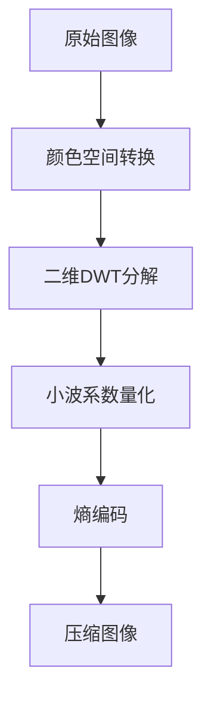

形象易懂讲解算法I——小波变换 - 咚懂咚懂咚的文章 - 知乎
https://zhuanlan.zhihu.com/p/22450818


## 核心概念
小波变换（Wavelet Transform）是一种**时频分析工具**，通过将信号分解为一系列**缩放和平移的基函数**（小波）来捕捉信号的局部特征。其数学定义为：
$$ CWT(a,b) = \frac{1}{\sqrt{|a|}} \int_{-\infty}^{\infty} f(t) \psi^* \left( \frac{t-b}{a} \right) dt $$
其中 $a$ 为尺度参数（控制频率），$b$ 为平移参数（控制时间位置），$\psi(t)$ 是**母小波函数**。与傅里叶变换相比，小波变换突破了**时频分辨率固定**的限制，可自适应调整窗口大小，在分析非平稳信号时具有显著优势。

### 关键特性
1. **时频局部化**：同时提供时间和频率信息，适合分析瞬态信号
2. **多分辨率分析**：通过尺度变换实现从粗粒度到细粒度的信号分解
3. **基函数多样性**：不同小波基适应不同信号特性

### 小波基选择标准
| 小波类型       | 支撑长度 | 正交性 | 对称性 | 适用场景               |
|----------------|----------|--------|--------|------------------------|
| Haar           | 2        | 是     | 对称   | 突变信号检测           |
| Daubechies(dbN)| 可变     | 是     | 不对称 | 图像压缩、去噪         |
| Morlet         | 无穷大   | 否     | 对称   | 时频分析               |
| Coiflets       | 可变     | 是     | 对称   | 信号压缩               |


---

## 数学原理与算法
### 连续小波变换（CWT）
通过连续缩放和平移母小波生成系数矩阵，适用于**高精度时频分析**：
$$ W(a,b) = \frac{1}{\sqrt{a}} \int_{-\infty}^{\infty} x(t) \psi^* \left( \frac{t-b}{a} \right) dt $$
缺点：**计算复杂度高**，适合离线分析。

### 离散小波变换（DWT）
采用**二进离散化**（$a=2^j, b=k \cdot 2^j$），通过滤波器组实现高效计算：
```python
import pywt
# 信号分解
coeffs = pywt.wavedec(data, 'db4', level=3)  # 3级分解，使用db4小波
cA3, cD3, cD2, cD1 = coeffs  # 近似系数 + 细节系数
# 信号重构
recon = pywt.waverec(coeffs, 'db4')
```
**分解过程**：  
1. 信号通过低通（$h[n]$）和高通滤波器（$g[n]$）  
2. 输出进行**二抽取**（downsampling）  
3. 递归分解近似系数

### 多分辨率分析（MRA）
![[多分辨率分解金字塔结构]](https://img-blog.csdnimg.cn/direct/1442b8d068e74b4ba5c3b99af2586800.png)  
将信号空间分层为**嵌套子空间**：  
$$ V_0 \supset V_1 \supset \cdots \supset V_j, \quad V_j = V_{j+1} \oplus W_{j+1} $$  
其中 $V_j$ 为近似空间，$W_j$ 为细节空间。

---

## 典型应用场景
### 1. 信号去噪
**小波阈值法**是主流方法：
- **硬阈值**：$ \hat{c} = \begin{cases} c & |c| \geq T \\ 0 & |c| < T \end{cases} $
- **软阈值**：$ \hat{c} = \text{sign}(c)(|c| - T)_+ $

```python
def wavelet_denoise(signal, wavelet='db4', level=3):
    coeffs = pywt.wavedec(signal, wavelet, level=level)
    # 估计噪声标准差
    sigma = mad(coeffs[-1]) / 0.6745  # 中值绝对偏差
    # 通用阈值
    threshold = sigma * np.sqrt(2 * np.log(len(signal)))
    # 软阈值处理细节系数
    coeffs[1:] = [pywt.threshold(c, threshold, mode='soft') for c in coeffs[1:]]
    return pywt.waverec(coeffs, wavelet)
```


### 2. 信号压缩
利用小波系数的**能量集中特性**：
1. 小波分解
2. **保留重要系数**（能量占比>95%）
3. 量化和熵编码（如Huffman编码）
JPEG 2000标准即基于DWT，相比传统DCT提升**压缩率20-30%**。

### 3. 特征提取
**小波系数能量**作为特征：
$$ E_j = \sum_k |c_{j,k}|^2 $$
应用于：
- 心电图中QRS波检测
- 机械故障诊断中的冲击特征识别
- 金融时间序列波动分析

---

## 图像处理扩展
### 图像去噪
**二维DWT**分解为LL（低频）、LH、HL、HH子带：
```python
from skimage.restoration import denoise_wavelet
denoised_img = denoised_wavelet(
    noisy_img, 
    wavelet='bior3.3', 
    mode='soft', 
    wavelet_levels=4
)
```
**评估指标**：
- PSNR：$ 20 \log_{10} \left( \frac{MAX_I}{\sqrt{MSE}} \right) $
- SSIM：结构相似性指数

### 图像压缩
JPEG 2000流程：

优势：支持**渐进传输**和**感兴趣区域编码**。

### Gabor小波在生物特征识别
$$ g(x,y) = \exp\left(-\frac{x'^2 + \gamma^2 y'^2}{2\sigma^2}\right) \cos\left(2\pi \frac{x'}{\lambda}\right) $$
其中 $x' = x\cos\theta + y\sin\theta$, $y' = -x\sin\theta + y\cos\theta$。  
Gabor小波模拟**人类视觉皮层响应**，对人脸识别中的**光照变化不敏感**。

---

## 进阶技术与最新进展
### 小波包变换（WPT）
突破DWT只分解近似系数的限制，实现**全子树分解**：
```python
wp = pywt.WaveletPacket(data, wavelet='db4', mode='symmetric', maxlevel=4)
```
优势：对**高频成分**分析更精细，适用于语音识别和脑电信号分析。

### 多小波分析
使用**多个母小波**构成基函数系统：
- GHM多小波：同时满足正交性、对称性和高阶消失矩
- 应用：图像融合中更好保留边缘信息

### 小波域机器学习
将小波系数作为**特征输入**深度学习模型：
1. **CNN+小波**：小波子带作为多通道输入
2. **小波注意力机制**：在Transformer中引入频域注意力
3. **压缩感知**：小波稀疏先验提升重建质量

---

## 代码实现案例
### Python信号去噪
```python
import numpy as np
import pywt
import matplotlib.pyplot as plt

# 生成含噪信号
t = np.linspace(0, 1, 1000)
x_clean = np.sin(2 * np.pi * 10 * t)
x_noisy = x_clean + 0.5 * np.random.randn(len(t))

# 小波去噪
def denoise(signal):
    coeffs = pywt.wavedec(signal, 'sym5', level=4)
    sigma = np.median(np.abs(coeffs[-1])) / 0.6745
    threshold = sigma * np.sqrt(2 * np.log(len(signal)))
    coeffs = [pywt.threshold(c, threshold, mode='soft') for c in coeffs]
    return pywt.waverec(coeffs, 'sym5')

x_denoised = denoise(x_noisy)

# 绘图
plt.figure(figsize=(10, 6))
plt.plot(t, x_noisy, alpha=0.5, label='Noisy')
plt.plot(t, x_clean, 'k--', label='Clean')
plt.plot(t, x_denoised, 'r', label='Denoised')
plt.legend()
```


### MATLAB图像压缩
```matlab
% 读取图像
img = imread('cameraman.tif');
% 小波分解
[c, s] = wavedec2(img, 3, 'db4');
% 保留前10%大系数
thresh = percentile(abs(c), 90);
c_comp = c .* (abs(c) >= thresh);
% 重构
img_comp = waverec2(c_comp, s, 'db4');
% 计算PSNR
psnr_val = psnr(img_comp, img);
```


---

## 总结与展望
小波变换凭借**时频局部化**和**多尺度分析**能力，已成为现代信号处理的基石技术。其核心优势体现在：
1. **非平稳信号处理**：优于傅里叶变换的瞬态特征捕获
2. **计算效率**：Mallat算法实现 $O(N)$ 复杂度
3. **领域适应性**：通过小波基选择匹配应用场景

**未来方向**：
- **与小波神经网络的融合**：提升特征表示能力
- **量子小波算法**：解决高维信号处理瓶颈
- **非均匀采样小波**：优化边缘计算场景性能

> **资源推荐**：  
> - [PyWavelets文档](https://pywavelets.readthedocs.io)  
> - [小波变换开源库（C++）](https://github.com/rafat/wavelib)  
> - [JPEG 2000标准详解](https://www.jpeg.org/jpeg2000/)
