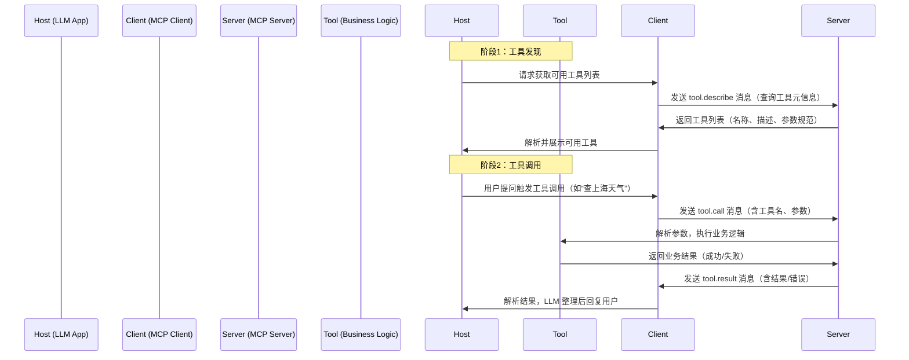

相关链接:
[模型上下文协议 - 维基百科，自由的百科全书](https://zh.wikipedia.org/zh-cn/%E6%A8%A1%E5%9E%8B%E4%B8%8A%E4%B8%8B%E6%96%87%E5%8D%8F%E8%AE%AE "模型上下文协议 - 维基百科，自由的百科全书")
[MCP官网](https://modelcontextprotocol.info/zh-cn/)

## 一、MCP 核心定义与起源
### 1. 本质定义
MCP 是由 Anthropic（Claude 研发团队）推出的**开源、标准化的应用层协议**，全称为 Model Context Protocol（模型上下文协议）。它的核心是**统一大语言模型（LLM）与外部工具/服务的交互方式**，让 LLM 能以标准化的方式发现、调用、管理外部能力（如数据库查询、API 调用、本地脚本执行等）。

简单来说：MCP 是 LLM 与外部工具之间的“通用翻译器 + 标准化接口”，解决了不同 LLM、不同工具之间交互格式碎片化的问题。

### 2. 诞生背景
在 MCP 出现前，LLM 调用外部工具主要依赖各厂商自定义的 Function Call（函数调用）能力，存在三大核心痛点：
- **碎片化**：OpenAI、Anthropic、Google 等厂商的 Function Call 格式、参数规范、交互流程互不兼容，适配一个模型的工具无法直接给另一个模型用；
- **耦合度高**：工具逻辑与 LLM 侧的调用逻辑深度绑定，新增/修改工具需同步修改 LLM 侧的配置/代码；
- **扩展性差**：缺乏统一的错误处理、权限控制、工具发现机制，难以规模化集成多工具。

MCP 的核心目标就是解决这些问题：**一次开发工具，所有支持 MCP 的 LLM 都能调用；一次定义规范，所有工具都能按统一方式交互**。

### 3. 核心特性
| 特性 | 具体说明 |
|------|----------|
| 标准化 | 统一的消息格式、工具描述规范、交互流程，跨模型/跨平台兼容 |
| 解耦性 | LLM 侧（调用方）与工具侧（提供方）完全解耦，各自独立迭代 |
| 可扩展 | 支持多工具注册、多传输协议（stdio/HTTP/SSE）、多模态能力扩展 |
| 安全可控 | 内置错误处理、权限校验、调用审计机制，支持用户审批流程 |
| 轻量级 | 协议本身无强依赖，Server 可极简实现（几十行代码即可落地） |

## 二、MCP 核心架构与交互模型
MCP 的架构遵循“客户端-服务器”（C/S）模型，但针对 LLM 交互场景做了优化，核心组件和流程如下：

### 1. 核心组件拆解
| 组件 | 角色定位 | 典型实现 |
|------|----------|----------|
| **MCP Host** | 发起工具调用的“主控方”，即支持 MCP 的 LLM 应用（如 Claude、Cursor） | Claude Web/API、Cursor IDE、自定义 LLM 应用 |
| **MCP Client** | Host 侧的“协议适配器”，负责将 LLM 的指令转为标准 MCP 消息，接收并解析 Server 返回的结果 | Anthropic SDK 内置 Client、mcp 库的 Client 模块 |
| **MCP Server** | 提供工具能力的“服务方”，封装业务逻辑并按 MCP 规范暴露接口 | 你之前实现的天气查询 Server、企业内部工具 Server |
| **Tool** | 具体的能力单元，是 Server 暴露的最小功能模块（如天气查询、库存查询） | 每个 Tool 对应一个具体功能，需按 MCP 规范定义元信息 |
| **Message** | 组件间的通信载体，所有交互都通过标准化的 MCP 消息完成 | JSON 格式的消息体，包含消息类型、工具名称、参数、结果等 |

### 2. 核心交互流程（时序）
Mermaid 流程图直观展示完整交互逻辑：


### 3. 核心消息类型（协议核心）
MCP 的交互本质是不同类型消息的传递，核心消息类型及用途如下（所有消息均为 JSON 格式）：

| 消息类型 | 用途 | 核心字段 |
|----------|------|----------|
| `tool.describe` | Host 查询 Server 提供的工具列表 | `tools`（工具元信息数组）、`name`（Server 名称） |
| `tool.call` | Host 调用具体工具 | `name`（工具名）、`arguments`（调用参数）、`call_id`（调用ID） |
| `tool.result` | Server 返回调用结果 | `call_id`（关联调用）、`content`（结果内容）、`error`（错误信息） |
| `error` | 通用错误反馈 | `code`（错误码）、`message`（错误描述）、`details`（详情） |

**示例：tool.call 消息体**
```json
{
  "type": "tool.call",
  "call_id": "call_123456",
  "name": "get_weather",
  "arguments": {
    "city": "上海"
  }
}
```

**示例：tool.result 消息体（成功）**
```json
{
  "type": "tool.result",
  "call_id": "call_123456",
  "content": [
    {
      "type": "text",
      "parts": [{"text": "上海今日天气：晴，温度18-25℃，风向东风，穿衣建议：薄外套"}]
    }
  ]
}
```

## 三、MCP 核心协议规范（技术细节）
MCP 的“标准化”核心体现在协议规范上，以下是必须遵守的关键规范（也是自定义 Server 的核心要点）：

### 1. 工具元信息规范（Tool Description）
每个 Tool 必须按如下格式定义元信息，否则 LLM 无法识别和调用：
```json
{
  "name": "工具唯一标识（小写，无空格）",
  "description": "清晰描述工具用途（LLM 依赖此判断何时调用）",
  "parameters": {
    "type": "object",
    "properties": {
      "参数名": {
        "type": "参数类型（string/number/boolean/array）",
        "description": "参数含义（LLM 依赖此传参）",
        "required": true/false,  // 是否必填
        "default": "默认值（可选）"
      }
    },
    "required": ["必填参数列表"]
  }
}
```
**关键注意点**：
- `description` 必须“人话化”且精准，比如“用于查询指定城市的当日天气信息”，而非“调用天气API”；
- `parameters` 的描述要详细，比如“city：要查询的城市名称（如北京、上海，需为中文全称）”，否则 LLM 可能传错参数。

### 2. 传输层协议规范
MCP 支持三种主流传输方式，适配不同场景：
| 传输方式 | 特点 | 适用场景 |
|----------|------|----------|
| **stdio** | 基于标准输入/输出交互，无需网络，轻量 | 本地工具、单机部署的私有服务 |
| **HTTP** | 基于 HTTP 接口交互，支持远程调用 | 跨机器/跨集群的公共工具、云服务 |
| **SSE/WebSocket** | 基于流式交互，支持实时推送 | 长连接场景（如实时日志查询、音视频处理） |

**stdio 模式核心规范**：
- 消息以 `\n` 分隔，每行一个完整 JSON 消息；
- Server 需监听 stdin，输出到 stdout，错误输出到 stderr；
- 必须处理 `tool.describe` 消息，返回工具列表。

### 3. 错误处理规范
MCP 定义了通用错误码体系，Server 需按如下格式返回错误：
| 错误码分类 | 示例码 | 含义 |
|------------|--------|------|
| 通用错误 | `INVALID_REQUEST` | 请求格式错误 |
| 参数错误 | `INVALID_PARAM` | 参数缺失/类型错误 |
| 工具错误 | `TOOL_ERROR` | 工具执行逻辑异常 |
| 权限错误 | `PERMISSION_DENIED` | 无调用权限 |
| 系统错误 | `SYSTEM_ERROR` | Server 内部异常 |

### 4. 多模态扩展规范
MCP 不仅支持文本交互，还支持图片、音频等多模态能力，只需扩展 `content` 字段：
```json
{
  "type": "tool.result",
  "call_id": "call_789",
  "content": [
    {
      "type": "image",
      "parts": [{"image_url": "https://example.com/weather_chart.png"}]
    },
    {
      "type": "text",
      "parts": [{"text": "上海未来7天天气趋势图如上"}]
    }
  ]
}
```

## 四、MCP 与传统 Function Call 的深度对比
很多人会混淆 MCP 和 Function Call，二者的核心差异体现在设计哲学和落地能力上：

| 维度 | 传统 Function Call（如 OpenAI/Anthropic 原生） | MCP |
|------|-----------------------------------------------|-----|
| 设计哲学 | 模型驱动：围绕特定 LLM 的能力设计，适配模型为主 | 协议驱动：围绕通用交互设计，适配工具为主 |
| 兼容性 | 仅支持特定模型（如 OpenAI 的 Function Call 仅支持 GPT 系列） | 所有支持 MCP 的模型通用，无需适配 |
| 工具发现 | 静态配置：工具列表需提前在 LLM 侧配置 | 动态发现：Host 可实时查询 Server 的工具列表 |
| 耦合度 | 高：工具参数/描述需在 LLM 侧定义，修改需同步更新 | 低：工具定义在 Server 侧，LLM 侧无需修改 |
| 扩展性 | 弱：新增工具需修改 LLM 侧代码/配置 | 强：新增 Server/工具，Host 无需任何改动 |
| 部署方式 | 仅支持远程 API 调用 | 支持本地（stdio）、远程（HTTP）、流式（SSE） |
| 安全控制 | 需手动实现权限/审计 | 协议内置基础安全机制，可扩展审批流程 |

**总结**：Function Call 是“模型的附属能力”，而 MCP 是“独立的交互协议”——MCP 可以兼容 Function Call（将 Function Call 封装为 MCP Server），但反之不行。

## 五、MCP 落地实践要点（避坑指南）
基于大量落地案例，总结自定义 MCP Server 的核心注意点：

### 1. 开发阶段
- **工具描述是核心**：LLM 完全依赖 `description` 判断是否调用工具，描述模糊会导致 LLM 不会触发调用（比如只写“查天气”不如写“用于查询中国城市的当日实时天气，包括温度、风向、穿衣建议”）；
- **参数校验要严格**：必须校验参数的存在性、类型、格式，避免业务逻辑崩溃（比如城市名不能为空、必须是字符串）；
- **异常处理要完整**：覆盖网络异常、API 异常、业务异常，返回标准化错误码，方便 Host 解析；
- **尽量轻量**：Server 无需复杂框架，纯 Python/JS/Go 原生代码即可实现，减少依赖。

### 2. 部署阶段
- **本地场景选 stdio**：无需网络，数据不出本地，适合隐私敏感的工具（如企业内部数据库查询）；
- **远程场景选 HTTP**：方便跨机器调用，可加鉴权（如 API Key、Token）；
- **流式场景选 SSE**：适合返回大结果或实时更新的场景（如日志查询、数据导出）。

### 3. 调试阶段
- 先通过 `tool.describe` 验证工具列表是否正确返回；
- 手动构造 `tool.call` 消息测试工具调用逻辑；
- 对接 LLM 前，先打印所有消息体，确认格式符合规范。

## 六、MCP 生态与未来演进
### 1. 现有支持生态
- **模型/应用**：Claude（核心支持）、Cursor IDE、Anthropic API、LangChain（已集成 MCP）；
- **开源库**：官方 `model-context-protocol`（Python/TS）、社区版 `mcp-server`（Go/Java）；
- **落地场景**：企业私有工具集成、本地化 AI 智能体、多工具组合调用（如“查订单→算税费→生成报表”）。

### 2. 未来演进方向
- **多模态深度支持**：完善图片、音频、视频的传输和处理规范；
- **权限精细化**：支持基于角色的访问控制（RBAC）、调用审批流程；
- **分布式调用**：支持多 Server 集群、工具负载均衡；
- **标准化扩展**：推出 MCP 规范版本（如 1.0、2.0），兼容更多厂商。

---

## 总结
1. MCP 的核心价值是**标准化 LLM 与外部工具的交互**，解决了 Function Call 碎片化、耦合度高的问题，实现“一次开发，多模型复用”；
2. 自定义 MCP Server 的关键是**按规范定义工具元信息**（名称、描述、参数），并实现标准化的消息处理逻辑；
3. MCP 不同传输模式适配不同场景：stdio 适合本地隐私场景，HTTP 适合远程公共场景，SSE 适合流式交互场景。

如果你想针对某个具体场景（如企业内部数据库查询的 MCP Server、多工具组合的 MCP 服务）做深入落地，或者想了解 MCP 与 LangChain/AutoGPT 的集成方式，都可以告诉我，我会给出针对性的方案！