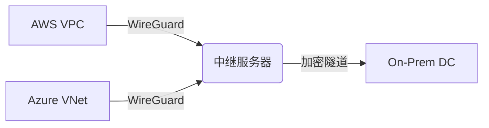

https://github.com/WireGuard/wireguard-go

https://github.com/PinkD/corplink-rs/releases


# WireGuard：现代VPN架构的革命者

> 简洁、安全、高效的新一代VPN协议完全解析

## 1 核心特性与演进历程
WireGuard是由Jason A. Donenfeld于2015年设计的**开源VPN协议**，2020年正式并入Linux 5.6内核，标志着其成为**下一代VPN标准**。相较于传统方案（如OpenVPN和IPsec），其革命性优势体现在：

- **性能颠覆**：内核级数据包处理使传输速度达OpenVPN的**5倍以上**，延迟降低70%-80%，4K视频传输几乎无卡顿[citation:3][citation:6]
- **极致精简**：约4000行代码（OpenVPN约60万行），攻击面大幅缩小，Linux之父Linus Torvalds评价其为“**密码学艺术品**”[citation:3][citation:6]
- **现代加密体系**：整合Noise协议框架、Curve25519椭圆曲线、ChaCha20流加密和BLAKE2哈希算法，提供**前向保密**保障[citation:6][citation:8]
- **动态适应性**：支持UDP漫游与NAT穿透，设备切换网络时**自动重连无需人工干预**[citation:4][citation:8]

## 2 技术原理深入解析
### 2.1 密码学基础
WireGuard的安全性建立在**严格的密码学原语**上：
- **密钥交换**：基于Curve25519椭圆曲线实现Diffie-Hellman密钥协商，会话密钥动态生成：
  $$ \text{session_key} = \text{Curve25519}(private_{local}, public_{remote}) $$
- **数据加密**：采用ChaCha20对称流加密算法，配合Poly1305认证标签，在通用CPU上性能超越AES[citation:6][citation:8]
- **身份验证**：每个节点持有固定私钥/公钥对，通过BLAKE2s实现高效消息认证

### 2.2 隧道机制
WireGuard通过虚拟网络接口（如`wg0`）建立加密隧道：
```bash
# 创建虚拟接口
ip link add wg0 type wireguard
```
数据包处理流程包含三个核心阶段：
1. **入口验证**：解密数据包后校验源IP与AllowedIPs匹配性
2. **路由决策**：通过公钥与IP的绑定关系（Cryptokey Routing）确定目标节点
3. **出口加密**：使用对等节点公钥加密数据包[citation:1][citation:8]

### 2.3 路由设计哲学
配置中的`AllowedIPs`参数体现其独特路由逻辑：
| **节点类型** | **AllowedIPs设置** | **设计意图**          | **错误配置后果**       |
|--------------|--------------------|-----------------------|-----------------------|
| 服务端       | `/32`精确IP        | 隔离客户端避免路由冲突 | 多客户端无法互通       |
| 客户端       | `/24`子网范围      | 感知整个VPN网络       | 无法访问其他客户端[citation:1] |

## 3 典型应用场景分析
### 3.1 安全远程办公
- **家庭NAS访问**：通过云服务器中转，实现无公网IP的NAS设备安全暴露SSH/Web服务[citation:1]
  ```bash
  # 云服务器端口转发规则
  sudo firewall-cmd --add-forward-port=port=2222:proto=tcp:toaddr=10.8.0.2:toport=22
  ```
- **跨区域组网**：连接三地办公网络（A/B/C），通过中继服务器构建统一内网[citation:4]
  ```ini
  # 中继服务器配置片段
  [Peer] # A地节点
  PublicKey = A_public_key
  AllowedIPs = 192.168.1.0/24

  [Peer] # B地节点
  PublicKey = B_public_key
  AllowedIPs = 192.168.2.0/24
  ```

### 3.2 混合云组网
- **VPC互通**：打通AWS/Azure/GCP的私有网络，避免公网传输风险
- **边缘计算**：IoT设备通过WireGuard直连云控制平面，时延低于20ms[citation:6]

### 3.3 隐私保护增强
- **全局流量加密**：客户端设置`AllowedIPs = 0.0.0.0/0`可规避ISP监控
- **DNS防泄漏**：强制指定DNS服务器防止请求暴露[citation:3]
  ```ini
  [Interface]
  DNS = 8.8.8.8, 1.1.1.1
  ```

## 4 实战配置指南
### 4.1 服务端部署（Ubuntu示例）
```bash
# 安装组件
sudo apt install wireguard resolvconf -y

# 密钥生成
umask 077
wg genkey | tee /etc/wireguard/privatekey | wg pubkey > /etc/wireguard/publickey

# 配置文件 /etc/wireguard/wg0.conf
[Interface]
Address = 10.8.0.1/24
ListenPort = 51820
PrivateKey = <server_private_key>
PostUp = iptables -A FORWARD -i wg0 -j ACCEPT; iptables -t nat -A POSTROUTING -o eth0 -j MASQUERADE
PostDown = iptables -D FORWARD -i wg0 -j ACCEPT; iptables -t nat -D POSTROUTING -o eth0 -j MASQUERADE

[Peer] # 客户端1
PublicKey = <client1_public_key>
AllowedIPs = 10.8.0.2/32
```

### 4.2 客户端配置（Windows）
1. 从[官网](https://www.wireguard.com/install/)下载客户端
2. 生成密钥对并导入配置：
   ```ini
   [Interface]
   PrivateKey = <client_private_key>
   Address = 10.8.0.2/24
   DNS = 8.8.8.8

   [Peer]
   PublicKey = <server_public_key>
   Endpoint = 1.2.3.4:51820
   AllowedIPs = 10.8.0.0/24
   PersistentKeepalive = 25
   ```

### 4.3 多设备管理技巧
```bash
# 批量添加客户端脚本
#!/bin/bash
CLIENT_IP="10.8.0.$((RANDOM%253+2))"
wg genkey | tee client_privatekey | wg pubkey > client_publickey
echo -e "[Peer]\nPublicKey = $(cat client_publickey)\nAllowedIPs = $CLIENT_IP/32" >> /etc/wireguard/wg0.conf
wg syncconf wg0 <(wg-quick strip wg0)
```

## 5 进阶优化与监控
### 5.1 性能调优
- **MTU优化**：通过`MTU = 1420`避免IPsec封装导致的分片[citation:8]
- **多核利用**：Linux内核≥5.8支持多队列处理，提升吞吐量：
  ```bash
  ethtool -L eth0 combined 4   # 启用4个传输队列
  ```

### 5.2 安全加固
- **防火墙策略**：限制SSH仅VPN IP访问
  ```bash
  sudo firewall-cmd --add-rich-rule='rule family=ipv4 source address=10.8.0.1 port port=22 protocol=tcp accept'
  ```
- **密钥轮换**：每90天更新密钥对降低泄露风险[citation:1]

### 5.3 状态监控
- **实时流量分析**：
  ```bash
  watch -n 1 wg   # 实时流量统计
  ```
- **Prometheus监控**：通过[wireguard_exporter](https://github.com/MindFlavor/prometheus_wireguard_exporter)收集指标

## 6 行业应用案例
### 6.1 家庭实验室架构
  
*云服务器（10.8.0.1）作为中继，连接家庭NAS（10.8.0.2）与手机（10.8.0.3），实测内网传输速度达14.8MB/s[citation:7]*

### 6.2 企业多云互联


### 6.3 云原生集成
- **Kubernetes**：通过k8s-overlay实现Pod间加密通信
- **Docker网络**：创建WireGuard驱动的overlay网络：
  ```bash
  docker network create --driver wireguard --subnet 10.13.0.0/24 wg-net
  ```

## 7 未来发展与替代方案
### 7.1 局限性改进
- **NAT穿透深度**：正在开发UDP-HTTP隧道模式应对严格防火墙
- **量子安全**：实验性支持PQ-WireGuard（基于NIST后量子候选算法）[citation:8]

### 7.2 适用场景对比
| **场景**         | **推荐协议** | **优势体现**               |
|------------------|--------------|--------------------------|
| 高延迟网络        | Tailscale    | DERP中继优化              |
| 企业级认证集成    | OpenVPN      | LDAP/Radius支持成熟       |
| 移动端频繁漫游    | WireGuard    | 秒级重连与低能耗[citation:6] |

> 通过内核级优化和密码学创新，WireGuard正在重塑安全通信的边界。其设计哲学证明：**简洁性**与**高性能**可兼得，这正是现代网络基础设施的终极追求。