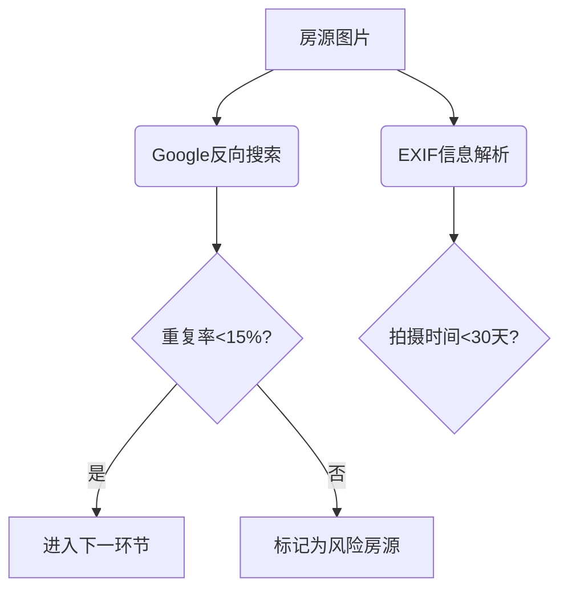
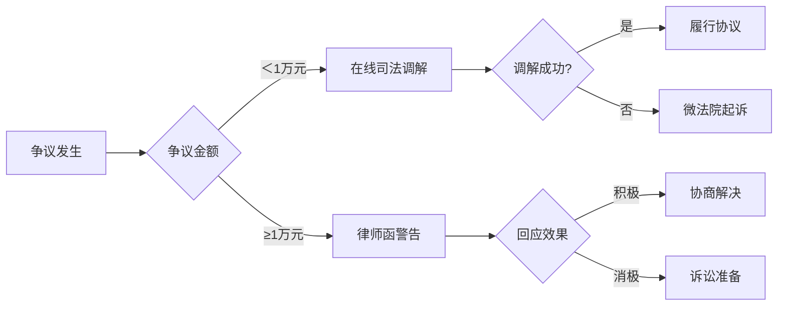

# 毕业生租房避坑指南与技术框架

## 引言
2025年住房租赁市场呈现"智能化+法治化"双轨发展，毕业生租房需掌握结构化决策模型与法律武器。本文融合《民法典》最新司法解释与智能租房工具，构建三维租房决策系统。

---

## 租房不可能三角模型
$$ \text{满意度} = \frac{\alpha \cdot \text{房品} + \beta \cdot \text{区位} + \gamma \cdot \text{成本}}{\text{决策周期}} $$
其中$\alpha+\beta+\gamma=1$，建议毕业生权重分配$\alpha=0.4,\beta=0.4,\gamma=0.2$

### 地理影响参数
| 城市类型   | 通勤半径(km) | 租金梯度衰减率 |
|------------|--------------|----------------|
| 一线城市   | ≤15          | 0.8-1.2万/㎡/月 |
| 新一线城市 | ≤10          | 0.5-0.8万/㎡/月 |
| 二线城市   | ≤8           | 0.3-0.5万/㎡/月 |

### 建筑参数约束
```python
def housing_score(floor, orientation):
    # 楼层修正系数: 1层0.8, 2-5层1.0, 6层以上0.95
    # 朝向修正系数: 南1.0, 东南0.98, 西南0.95
    return floor_coeff * orientation_coeff
```

---

## 技术选房流程
### 1. 数字孪生看房
- **3D建模工具**: 贝壳如视/链家VR
- **噪音云图**: 使用DecibelX测量早晚噪音值
- **光照模拟**: Sun Seeker APP生成日照轨迹图

### 2. 风险检测系统


---

## 合约智能审查
### 关键条款矩阵
| 条款类型       | 法律风险等级 | 应对策略                      |
|----------------|--------------|-------------------------------|
| 转租条款       | ★★★★☆        | 要求提供原始租赁合同      |
| 维修责任       | ★★★☆☆        | 补充设备损耗清单          |
| 违约金条款     | ★★★★★        | 约定双向对等责任         |
| 优先续租权     | ★★☆☆☆        | 添加自动续约触发条件          |

### 电子存证方案
1. 合同扫描件哈希值上链（蚂蚁链/腾讯至信链）
2. 房屋交割视频存证（需包含时间戳+地理坐标）
3. 重要沟通记录存证（微信存证功能）

---

## 费用控制体系
### 水电费动态模型
$$ \text{月均支出} = \sum_{i=1}^{n}(P_i \cdot Q_i) + \delta $$
- $P_i$: 水/电/燃气阶梯单价
- $Q_i$: 各阶梯用量
- $\delta$: 公摊系数（合租按$0.3m^2$/人计算）

| 城市   | 民用电(元/度) | 商用电(元/度) | 差异系数 |
|--------|---------------|---------------|----------|
| 深圳   | 0.66          | 1.25          | 1.89x    |
| 杭州   | 0.58          | 1.15          | 1.98x    |
| 成都   | 0.52          | 1.05          | 2.02x    |

---

## 智能安防配置
### 物联网设备清单
| 设备类型       | 推荐型号       | 功能亮点                     |
|----------------|----------------|------------------------------|
| 智能门锁      | 小米智能门锁M20 | 临时密码+异常开锁报警        |
| 水浸传感器    | Aqara水浸卫士  | 0.5mm精度检测+APP联动        |
| 空气质量检测  | 青萍空气检测仪 | PM2.5/VOC/甲醛三合一         |
| 全景摄像头    | 萤石C6CN       | 360°云台+哭声检测            |

---

## 法律维权路径
### 纠纷解决决策树


---

## 动态租金预测
### LSTM神经网络
```python
from tensorflow.keras.models import Sequential
from tensorflow.keras.layers import LSTM, Dense

model = Sequential()
model.add(LSTM(50, input_shape=(train_X.shape[1], train_X.shape[2])))
model.add(Dense(1))
model.compile(loss='mae', optimizer='adam')
# 输入特征包含: 地铁站距、房龄、楼层、历史租金等12维数据
```

---

> **参考资料**：  
> [全网最详细租房全流程攻略](https://www.bilibili.com/video/BV1auC2YvEQR/)  
> [民法典租赁合同司法解释](http://www.court.gov.cn)  
> [2025住房租赁白皮书](https://research.lianjia.com)

: 转租需提供原始合同
: 设备损耗清单
: 双向对等责任条款
