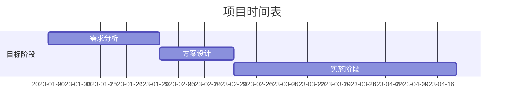

## 定义与起源

SMART原则是一种广泛应用于项目管理、个人发展和绩效评估的目标设定框架。该原则最早由George T. Doran在1981年发表于《管理评论》(Management Review)的文章中提出，标题为["There's a S.M.A.R.T. Way to Write Management's Goals and Objectives"](https://community.mis.temple.edu/mis0855002fall2015/files/2015/10/S.M.A.R.T-Way-Management-Review.pdf)。

SMART是一个首字母缩写词，代表：

- **S**pecific（具体的）
- **M**easurable（可衡量的）
- **A**ttainable（可实现的）
- **R**elevant（相关的）
- **T**ime-bound（有时限的）

## 原理与核心要素

### Specific（具体的）

目标必须清晰明确，避免模糊不清的表述。具体的目标应该回答以下问题：

- 要实现什么？
- 为什么要实现它？
- 谁参与其中？
- 在哪里进行？
- 需要哪些资源或限制？

数学表达上，我们可以将目标函数定义为：
$$ f(x) = \text{明确可执行的操作} $$

### Measurable（可衡量的）

目标必须包含可量化的标准或指标，以便评估进度和最终成果。可衡量的要素包括：

- 定量指标（如数量、百分比）
- 定性指标（如客户满意度评分）
- 里程碑检查点

例如，在软件开发中，我们可以设置：
```python
def is_goal_achieved(progress):
    return progress >= 0.8  # 80%完成度
```

### Attainable（可实现的）

目标应该在能力范围内具有挑战性但可实现。需要考虑：

- 可用资源（时间、资金、人力）
- 技能水平
- 外部约束条件

可用以下不等式表示可行性：
$$ \text{资源需求} \leq \text{可用资源} $$

### Relevant（相关的）

目标应与更广泛的战略目标或个人价值观保持一致。相关性评估包括：

- 是否符合组织/个人长期目标？
- 是否在正确的时间点？
- 是否匹配其他相关方的需求？

### Time-bound（有时限的）

目标必须有明确的截止日期或时间框架。时间要素包括：

- 开始日期
- 结束日期
- 关键里程碑时间点

甘特图是表示时间约束的有效工具：



## 发展历程与变体

自1981年提出以来，SMART原则经历了多次演变和扩展：

1. **原始版本**：Doran最初提出的SMART
2. **扩展版本**：SMARTER（增加Evaluated和Reviewed）
3. **军事版本**：美国陆军采用的SMART（Simple, Measurable, Achievable, Relevant, Time-bound）
4. **敏捷版本**：与敏捷开发结合的SMART

目标设定理论和关键绩效指标与SMART原则有密切联系。

## 适用场景

SMART原则广泛应用于：

1. **项目管理**
   - 项目目标定义
   - 任务分解结构(WBS)创建
   - 里程碑设定

2. **个人发展**
   - 职业规划
   - 技能提升计划
   - 健康管理目标

3. **绩效管理**
   - KPI设定
   - 员工评估标准
   - 奖励机制设计

4. **教育领域**
   - 学习目标设定
   - 教学计划制定
   - 研究项目规划

## 实践方法与案例

### 目标设定步骤

1. **头脑风暴**：列出所有潜在目标
2. **SMART筛选**：按原则评估每个目标
3. **优先级排序**：使用如ICE评分（Impact, Confidence, Ease）
4. **行动计划**：分解为可执行任务
5. **跟踪评估**：定期检查进度

### 软件开发案例

**非SMART目标**："改善网站性能"

**SMART转换后**：
- **Specific**：通过优化数据库查询和缓存策略，将首页加载时间从3秒降至1秒以内
- **Measurable**：使用Lighthouse工具测量，得分从70提升到90+
- **Attainable**：分配2名开发人员，预算$5,000，时间2周
- **Relevant**：符合Q2提升用户体验的战略目标
- **Time-bound**：在2023年6月30日前完成

技术实现可能包括：
```python
# 伪代码示例：性能优化检查
def optimize_website():
    current_load_time = measure_load_time()
    target_load_time = 1.0  # 秒
    
    while current_load_time > target_load_time:
        apply_optimization()
        current_load_time = measure_load_time()
        if time_exceeded(deadline):
            raise TimeoutError("优化未在时限内完成")
    
    return current_load_time
```

## 常见误区与应对策略

1. **过度量化**：忽视定性指标的重要性
   *解决方案*：平衡定量与定性指标

2. **目标僵化**：无法适应环境变化
   *解决方案*：建立定期评审机制

3. **资源错配**：低估实现难度
   *解决方案*：进行可行性分析（PESTEL或SWOT）

4. **短期主义**：忽视长期价值
   *解决方案*：将SMART目标与OKR框架结合

## 最新进展与工具支持

### 智能化SMART

现代项目管理工具如Jira、Asana和Trello都集成了SMART原则：

1. **AI辅助目标设定**：如[ClickUp的智能目标](https://clickup.com/features/goals)
2. **自动进度跟踪**：集成数据分析仪表板
3. **协同目标管理**：多人实时编辑和评论

### 研究前沿

1. **神经科学应用**：研究目标设定对大脑激励机制的影响
2. **跨文化研究**：不同文化背景下SMART原则的有效性差异
3. **量子计算领域**：将SMART应用于量子算法开发目标设定

## 数学建模与优化

我们可以将SMART原则形式化为优化问题：

$$
\begin{aligned}
&\text{最大化} \quad f(x) = w_1S(x) + w_2M(x) + w_3A(x) + w_4R(x) + w_5T(x) \\
&\text{约束条件} \quad g_i(x) \leq 0, \quad i = 1,...,m \\
&\quad \quad \quad \quad h_j(x) = 0, \quad j = 1,...,p
\end{aligned}
$$

其中：
- $w$ 是各维度的权重
- $S(x), M(x),...,T(x)$ 是各准则的评分函数
- $g_i(x)$ 和 $h_j(x)$ 是资源约束

## 结论与展望

SMART原则作为经典的目标管理框架，在数字化时代展现出新的活力。未来发展方向可能包括：

1. **与AI集成**：智能目标生成和动态调整
2. **实时反馈系统**：IoT设备自动采集进度数据
3. **个性化适配**：基于个人工作模式的自适应SMART

无论技术如何发展，SMART原则的核心价值——提供清晰、可执行的目标设定方法——将继续指导个人和组织实现卓越绩效。

## 延伸阅读

1. 目标设定理论
2. OKR方法论
3. 项目管理知识体系
4. [Doran的原始论文](https://community.mis.temple.edu/mis0855002fall2015/files/2015/10/S.M.A.R.T-Way-Management-Review.pdf)
5. [SMART原则在敏捷开发中的应用](https://www.scrum.org/resources/blog/applying-smart-goals-agile)